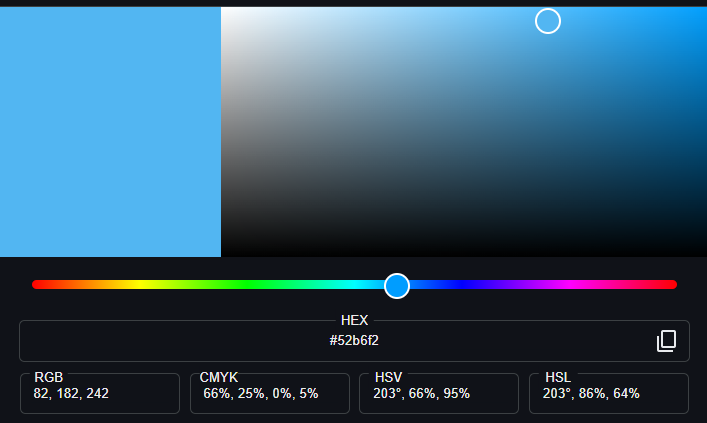
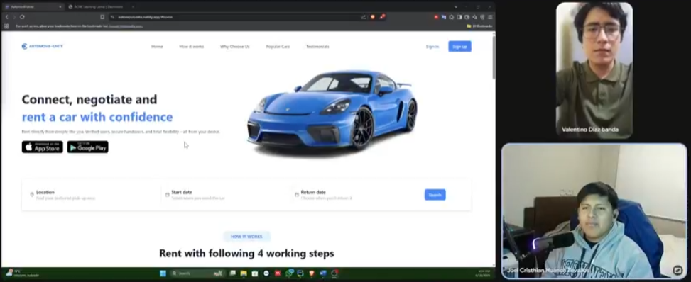

<div align = "center">
  <h1>Universidad Peruana de Ciencias Aplicadas</h1>
  
  <h2 >Carrera: de Ingeniería de Software</h2>
  <h2 >Ciclo: 2025-01</h2>
  <br>
  <h2 >Curso: Desarrollo de Aplicaciones Web</h2>
  <h2 >Sección: 4380</h2>
  <br>
  <h2 >Informe del TB1</h2>
  <h2 >Startup: NovaCode</h2>
  <h2 >Producto: Automovil-Unite</h2>
  <br>
  <h2 >Integrantes:</h2>
  <ul style="list-style: none; padding: 0;">
      <li><h3>Josue Gonzalo Paiva Quispe</h3></li>
      <li><h3>Carlos Alejandro De La Cruz Villarreal</h3></li>
      <li><h3>Josue Antonio Flores Apaico</h3></li>
      <li><h3>Poly Gabriel Alcantara Baldeon</h3></li>
      <li><h3>Cristhian Joel Huanca Zevallos</h3></li>
  </ul>
  <br>
  <h4>Abril del 2025</h4>
</div>

## Registro de Versiones del Informe

| Versión  | Fecha      | Autor                                            | Descripción de modificación   |
|----------|------------|--------------------------------------------------|-------------------------------|
| 0.1      | 24/04/2025 | Todos los integrantes                            | Primer sprint TB1             |
| 0.2      | 10/05/20205| Christian Huanca, Carlos De La Cruz, Josue Paiva | Segundo sprint TP1            |

| URL de la organización del proyecto |      URL del repositorio del reporte       |
|:-----------------------------------:|:------------------------------------------:|
| https://github.com/Grupo-3-Apps-Web | https://github.com/Grupo-3-Apps-Web/Report |

- [Student Outcome](#student-outcome)

- [Capítulo I: Introducción](#cap1)
    - [1.1. Startup Profile](#11-startup-profile)
        - [1.1.1. Descripción de la Startup](#111-descripción-de-la-startup)
        - [1.1.2. Perfiles de integrantes del equipo](#112-perfiles-de-integrantes-del-equipo)
    - [1.2. Solution Profile](#12-solution-profile)
        - [1.2.1 Antecedentes y problemática](#121-antecedentes-y-problemática)
        - [1.2.2 Lean UX Process](#122-lean-ux-process)
            - [1.2.2.1. Lean UX Problem Statements](#1221-lean-ux-problem-statements)
            - [1.2.2.2. Lean UX Assumptions](#1222-lean-ux-assumptions)
            - [1.2.2.3. Lean UX Hypothesis Statements](#1223-lean-ux-hypothesis-statements)
            - [1.2.2.4. Lean UX Canvas](#1224-lean-ux-canvas)
    - [1.3. Segmentos objetivo](#13-segmentos-objetivo)

- [Capítulo II: Requirements Elicitation & Analysis](#cap2)
    - [2.1. Competidores](#21-competidores)
        - [2.1.1. Análisis competitivo](#211-análisis-competitivo)
        - [2.1.2. Estrategias y tácticas frente a competidores](#212-estrategias-y-tácticas-frente-a-competidores)
    - [2.2. Entrevistas](#22-entrevistas)
        - [2.2.1. Diseño de entrevistas](#221-diseño-de-entrevistas)
        - [2.2.2. Registro de entrevistas](#222-registro-de-entrevistas)
        - [2.2.3. Análisis de entrevistas](#223-análisis-de-entrevistas)
    - [2.3. Needfinding](#23-needfinding)
        - [2.3.1. User Personas](#231-user-personas)
        - [2.3.2. User Task Matrix](#232-user-task-matrix)
        - [2.3.3. User Journey Mapping](#233-user-journey-mapping)
        - [2.3.4. Empathy Mapping](#234-empathy-mapping)
        - [2.3.5. As-is Scenario Mapping](#235-as-is-scenario-mapping)
    - [2.4. Ubiquitous Language](#24-ubiquitous-language)


- [Capítulo III: Requirements Specification](#cap3)
    - [3.1. To-Be Scenario Mapping](#31-to-be-scenario-mapping)
    - [3.2. User Stories](#32-user-stories)
    - [3.3. Impact Mapping](#33-impact-mapping)
    - [3.4. Product Backlog](#34-product-backlog)


- [Capítulo IV: Product Design](#cap4)
    - [4.1. Style Guidelines](#41-style-guidelines)
        - [4.1.1. General Style Guidelines](#411-general-style-guidelines)
        - [4.1.2. Web Style Guidelines](#412-web-style-guidelines)
    - [4.2. Information Architecture](#42-information-architecture)
        - [4.2.1. Organization Systems](#421-organization-systems)
        - [4.2.2. Labeling Systems](#422-labeling-systems)
        - [4.2.3. SEO Tags and Meta Tags](#423-seo-tags-and-meta-tags)
        - [4.2.4. Searching Systems](#424-searching-systems)
        - [4.2.5. Navigation Systems](#425-navigation-systems)
    - [4.3. Landing Page UI Design](#43-landing-page-ui-design)
        - [4.3.1. Landing Page Wireframe](#431-landing-page-wireframe)
        - [4.3.2. Landing Page Mock-up](#432-landing-page-mock-up)
    - [4.4. Web Applications UX/UI Design](#44-web-applications-uxui-design)
        - [4.4.1. Web Applications Wireframes](#441-web-applications-wireframes)
        - [4.4.2. Web Applications Wireflow Diagrams](#442-web-applications-wireflow-diagrams)
        - [4.4.3. Web Applications Mock-ups](#443-web-applications-mock-ups)
        - [4.4.4. Web Applications User Flow Diagrams](#444-web-applications-user-flow-diagrams)
    - [4.5. Web Applications Prototyping](#45-web-applications-prototyping)
    - [4.6. Domain-Driven Software Architecture](#46-domain-driven-software-architecture)
        - [4.6.1. Software Architecture Context Diagram](#461-software-architecture-context-diagram)
        - [4.6.2. Software Architecture Container Diagrams](#462-software-architecture-container-diagrams)
        - [4.6.3. Software Architecture Components Diagrams](#463-software-architecture-components-diagrams)
    - [4.7. Software Object-Oriented Design](#47-software-object-oriented-design)
        - [4.7.1. Class Diagrams](#471-class-diagrams)
        - [4.7.2. Class Dictionary](#472-class-dictionary)
    - [4.8. Database Design](#48-database-design)
        - [4.8.1. Database Diagram](#481-database-diagram)


- [Capítulo V: Product Implementation, Validation & Deployment](#cap5)
    - [5.1. Software Configuration Management](#51-software-configuration-management)
        - [5.1.1. Software Development Environment Configuration](#511-software-development-environment-configuration)
        - [5.1.2. Source Code Management](#512-source-code-management)
        - [5.1.3. Source Code Style Guide & Conventions](#513-source-code-style-guide--conventions)
        - [5.1.4. Software Deployment Configuration](#514-software-deployment-configuration)
    - [5.2. Landing Page, Services & Applications Implementation](#52-landing-page-services--applications-implementation)
        - [5.2.1. Sprint 1](#521-sprint-1)
            - [5.2.1.1. Sprint Planning 1](#5211-sprint-planning-1)
            - [5.2.1.2. Sprint Backlog 1](#5212-sprint-backlog-1)
            - [5.2.1.3. Development Evidence for Sprint Review](#5213-development-evidence-for-sprint-review)
            - [5.2.1.4.  Suite Evidence for Sprint Review](#5214-suite-evidence-for-sprint-review)
            - [5.2.1.5. Execution Evidence for Sprint Review](#5215-execution-evidence-for-sprint-review)
            - [5.2.1.6. Services Documentation Evidence for Sprint Review](#5216-services-documentation-evidence-for-sprint-review)
            - [5.2.1.7. Software Deployment Evidence for Sprint Review](#5217-software-deployment-evidence-for-sprint-review)
            - [5.2.1.8. Team Collaboration Insights during Sprint](#5218-team-collaboration-insights-during-sprint)
        - [5.2.2. Sprint 2](#522-sprint-2)
            - [5.2.2.1. Sprint Planning 2](#5221-sprint-planning-2)
            - [5.2.2.2. Sprint Backlog 2](#5222-sprint-backlog-2)
            - [5.2.2.3. Development Evidence for Sprint Review](#5223-development-evidence-for-sprint-review)
            - [5.2.2.4. Testing Suite Evidence for Sprint Review](#5224-testing-suite-evidence-for-sprint-review)
            - [5.2.2.5. Execution Evidence for Sprint Review](#5225-execution-evidence-for-sprint-review)
            - [5.2.2.6. Services Documentation Evidence for Sprint Review](#5226-services-documentation-evidence-for-sprint-review)
            - [5.2.2.7. Software Deployment Evidence for Sprint Review](#5227-software-deployment-evidence-for-sprint-review)
            - [5.2.2.8. Team Collaboration Insights during Sprint](#5228-team-collaboration-insights-during-sprint)
        - [5.2.3. Sprint 3](#523-sprint-3)
            - [5.2.3.1. Sprint Planning 3](#5231-sprint-planning-3)
            - [5.2.3.2. Sprint Backlog 3](#5232-sprint-backlog-3)
            - [5.2.3.3. Development Evidence for Sprint Review](#5233-development-evidence-for-sprint-review)
            - [5.2.3.4. Testing Suite Evidence for Sprint Review](#5234-testing-suite-evidence-for-sprint-review)
            - [5.2.3.5. Execution Evidence for Sprint Review](#5235-execution-evidence-for-sprint-review)
            - [5.2.3.6. Services Documentation Evidence for Sprint Review](#5236-services-documentation-evidence-for-sprint-review)
            - [5.2.3.7. Software Deployment Evidence for Sprint Review](#5237-software-deployment-evidence-for-sprint-review)
            - [5.2.3.8. Team Collaboration Insights during Sprint](#5238-team-collaboration-insights-during-sprint)
            - [5.2.4. Sprint 4](#524-sprint-4)
            - [5.2.4.1. Sprint Planning 4](#5241-sprint-planning-4)
            - [5.2.4.2. Sprint Backlog 4](#5242-sprint-backlog-4)
            - [5.2.4.3. Development Evidence for Sprint Review](#5243-development-evidence-for-sprint-review)
            - [5.2.4.4. Testing Suite Evidence for Sprint Review](#5244-testing-suite-evidence-for-sprint-review)
            - [5.2.4.5. Execution Evidence for Sprint Review](#5245-execution-evidence-for-sprint-review)
            - [5.2.4.6. Services Documentation Evidence for Sprint Review](#5246-services-documentation-evidence-for-sprint-review)
            - [5.2.4.7. Software Deployment Evidence for Sprint Review](#5247-software-deployment-evidence-for-sprint-review)
            - [5.2.4.8. Team Collaboration Insights during Sprint](#5248-team-collaboration-insights-during-sprint)
    - [5.3. Validation Interviews](#53-validation-interviews)
        - [5.3.1. Diseño de Entrevistas](#531-diseño-de-entrevistas)
        - [5.3.2. Registro de Entrevistas](#532-registro-de-entrevistas)
        - [5.3.3. Evaluaciones según heurísticas](#533-evaluaciones-según-heurísticas)
    - [5.4. Video About-the-Product](#54-video-about-the-product)
- [Conclusiones](#conclusiones)
- [Bibliografía](#bibliografía)
- [Anexos](#anexos)

## Student Outcome

El curso contribuye al cumplimiento del Student Outcome ABET:

**ABET – EAC - Student Outcome 3**

**Criterio:** *Capacidad de comunicarse efectivamente con un rango de audiencias.*
En el siguiente cuadro se describe las acciones realizadas y enunciados de
conclusiones por parte del grupo, que permiten sustentar el haber alcanzado el logro
del ABET – EAC - Student Outcome 3.

<table>
  <tr>
    <th>Criterio específico</th>
    <th>Acciones realizadas</th>
    <th>Conclusiones</th>
  </tr>
  <tr>
    <td>Trabaja en equipo para proporcionar liderazgo en forma conjunta.</td>
    <td>De La Cruz Villarreal Carlos Alejandro<br> TB1:Participación en las reuniones grupales.<br> Realización de entrevistas para ambos segmentos objetivos. <br> TP1: Asignación del bounded contextcorrespondiente y mejora con respecto al feedback de la entrega anterior. 
<br> Huanca Zevallos, Cristhian Joel <br> TB1: Presento sus ideas de manera clara y efectiva a diferentes publicos, ajustando su discurso según el segmento.<br> TP1: Desarrollo del bounded context asignado, así como también corregí las revisiones de la anterior entrega <br>Flores Apaico, Josue Antonio<br>
TB1: Comunicó sus ideas con claridad y se adaptó efectivamente a diferentes audiencias durante entrevistas y reuniones grupales.
<br> Josue Paiva:<br> TB1: Liderazgo del equipo, organización de reuniones, verificación de progreso del reporte y revisión de los mismos.
<br> TP1: Asignacion y explicacion de los bounded context a desarrollar, aplicacion de la retroalimentacion del entregable anterior
<br> Alcantara Baldeon Poly gabriel <br>TB1: Participación en reuniones grupales. Explicación del diseño orientado a objetos. 
    </td>
<td>Josue Paiva:Ejercer liderazgo me permitió desarrollar habilidades de comunicación y dirección con el equipo, además de tomar decisiones y responsabilidades en todo momento <br>
<br> Para este entregable colaboramos 3 de los 5 miembros originales, lo cual fue un reto; sin embargo, logramos cumplir con las metas asignadas a los aun presentes<br> De La Cruz Villarreal Carlos Alejandro <br> TB1: Hacer el trabajo en equipo fue un reto pues todos teníamos diferentes opiniones;sin embargo, con una buena comunicación asertiva logramos finalizar bien la entrega del proyecto<br>
TP1: Lograr realizar el proyecto de 3 integrantes fue muy difícil pero a la vez fue más organizado todo<br>
Huanca Zevallos, Cristhian Joel <br> TB1: La habilidad de adaptar la comunicación oral a diferentes audiencias mejora la claridad y la conexión con los demás, facilitando el intercambio de ideas en diversos contextos.<br> TP1: Fue un reto lograr hacer el proyecto de 3 personas pero a pesar de todo logramos cumplir con los bounded context asignados.<br>Alcantara Baldeon Poly Gabriel<br>TB1:Explicar el diseño fortaleció mi capacidad de comunicar ideas complejas de manera clara y adaptada al contexto del equipo.  </td>
  </tr>
  <tr>
    <td>Crea un entorno colaborativo e inclusivo, establece metas, planifica tareas y cumple objetivos.</td>
    <td>De la Cruz Villarreal Carlos Alejandro<br> TB1: Elaboración de ideas. <br> Elaboración de documentación técnica.<br> TP1: Elaboración del bounded context Navigation y traducción del idioma  <br> Huanca Zevallos, Cristhian Joel<br> TB1: Redacto textos organizados y comprensibles, utilizando un lenguaje apropiado.<br> TP1: Elaboración del bounded context de Navigation y footer <br>Flores Apaico, Josue Antonio<br> TB1: Redactó documentación clara y estructurada, adecuada para distintos públicos, demostrando precisión técnica y buen manejo del lenguaje.
<br> Josue Paiva:<br> TB1: Desarrollo del capítulo 1, Needfinding que incluye los journey maps, user personas, analisis competitivo y la formulacion de los user stories
<br>TP1: Implementacion del bounded context de publicacion y sus 4 operaciones CRUD
<br>Alcantara Baldeon Poly Gabriel<br>TB1:Elaboro el capitulo 4.7 Class Diagrams y Class Dictionary </td>
<td>Josue Paiva:<br> TB1: El primer entregable me permitio poner a prueba todos los conocimientos que vengo adquiriendo de diversos cursos como IHC, Diseño de patrones de software, etc. 
<br> TP1: Concluyo con una entrega completa considerando los user stories que se propusieron trabajar, pues se completó la implementacion de todos<br>De la Cruz Villarreal Carlos Alejandro<br> TB1: Esta primera entrega me permitió plasmar mis conocimientos de cursos de ciclos anteriores <br> TP1: La parte del bounded context asignada no logré terminarla al 100% pero pude apoyar haciendo el header y traducción
<br> Huanca Zevallos, Cristhian Joel <br> TB1: La capacidad de ajustar la escritura según el público permite una transmisión clara y precisa de ideas, mejorando la participación y comprensión en diversos entornos.<br>TP1: Logré terminar la parte del bounded context que se me asignó satisfactoriamente.<br>
Alcantara Baldeon Poly Gabriel<br>TB1:Documentar la Class Diagrams y realizar el diseño orientado a objetos me permitió desarrollar claridad técnica en la escritura, adecuada para audiencias académicas y técnicas.</td>
  </tr>
</table>

## Capítulo I: Introducción <a id="cap1"></a>
### 1.1. Startup Profile
En esta sección presentaremos nuestra start-up, el sector que buscamos incursionar, la soluciona propuesta a la problemática escogida y 
demás información pertinente para poder entender la vision del equipo con respecto al proyecto
#### 1.1.1. Descripción de la Startup
NovaCode es una startup creada por estudiantes de la carrera de Ingeniería de Software.
Para el presente ciclo desarrollaremos una aplicación web llamada Automovil-Unite, con la cual buscamos crear una plataforma destinada al alquiler de vehículos, con la cual tanto
los clientes que deseen alquilar, como los dueños de los vehículos puedan interactuar de una manera sencilla, rápida y segura.

**Misión:** Nuestra misión es proporcionar una plataforma segura y confiable donde ofrecer tus vehículos como alquiler o buscar un vehículo para alquilar.
**Visión:** Nuestra vision es la de convertirnos en la plataforma de alquiler de vehículos más confiable y segura del Perú, donde tanto los dueños como los clientes 
puedan interactuar de una manera rápida y sencilla.
#### 1.1.2. Perfiles de integrantes del equipo
<table>
  <tr><th colspan="2">Josue Paiva</th></tr>
  <tr><td></td>
<td>Soy Josue Paiva, tengo 22 años y soy de la carrera de Ingeniería de Software, tengo conocimiento de C++, Python y SQL, me gusta mantener buena comunicación con mis commpañeros de equipo, cumplir con mis tareas y apoyar al resto cuando se requiera.</td></tr>
  <tr><th colspan="2">Carlos De La Cruz Villarreal</th></tr>
  <tr><td></td>
    <td>Me llamo Carlos soy un estudiante de Ingeniería de Software, tengo 22 años y vivo en Lima. Mis pasatiempos son hacer deporte, jugar videojuegos y escuchar música. Me gusta trabajar en equipo porque de esta manera todos los integrantes podemos dar nuestro punto de vista e ideas para poder lograr el objetivo del curso. Además, para este curso me comprometo a ayudar en todo lo posible para la elaboración y desarrollo del trabajo.</td>
  </tr>
<tr><th colspan="2">Josue Antonio Flores Apaico</th></tr>
  <tr><td></td>
    <td>Soy Josue Flores es una persona creativa, perseverante y empática, con interés en áreas como la Inteligencia Artificial, ciberseguridad y ciencia de datos. Busca aplicar sus conocimientos en C++, Python, C# y Java dentro de una startup tecnológica, impulsando la innovación y la mejora continua. Cuenta con experiencia práctica en proyectos y participación en conferencias de ciberseguridad.</td></tr>
<tr><th colspan="2">Gabriel Alcantara Baldeon</th></tr>
   <tr><td></td>
    <td>Soy Poly Gabriel Alcántara Baldeón, estudiante de Ingeniería de Software en la UPC. Tengo conocimientos básicos en C#, Java y Python, y estoy en constante búsqueda de mejorar mis habilidades técnicas. Me considero una persona responsable y comprometida, que valora el trabajo en equipo y el apoyo mutuo. Siempre estoy dispuesto a colaborar en lo que sea necesario para lograr los objetivos comunes y asegurar que cada tarea se complete de forma eficiente.</td>
  </tr>
<tr><th colspan="2">Cristhian Joel Huanca Zevallos</th></tr>
  <tr><td></td>
    <td>Me considero una persona proactiva, organizada y responsable al momento de desarrollar un nuevo proyecto en mi vida. En un grupo de trabajo siempre trato de respetar las opiniones de los demás, trato de entender los demás puntos de vista y animo a estar en unión frente a un problema. </td>
  </tr>
</table>

### 1.2. Solution Profile
#### 1.2.1. Antecedentes y problemática
###### What
¿Cuál es el problema?
La escasez de opciones tanto web como móviles para el alquiler de vehículos en Perú, 
que ofrezcan una plataforma segura y confiable para ambas partes involucradas en el alquiler.
###### When
¿Cuándo sucede el problema?
El problema sucede a la hora de buscar plataformas que ofrezcan alquileres de vehículos a dueños directos, ya que la mayoría de plataformas existentes son de empresas grandes que no ofrecen una atención personalizada.
Del mismo modo los dueños no cuentan con una plataforma que ofrezca seguridad para el alquiler de sus vehículos

###### Where
¿Dónde surge el problema?
Este problema surge en Perú, donde la mayoría de plataformas de alquiler de vehículos son de empresas grandes que no ofrecen una atención personalizada.

###### Who
¿Quiénes se ven perjudicados por esta situación?
Se ven perjudicados jóvenes y adultos peruanos que, por un lado, no encuentran una plataforma confiable donde poder ofrecer sus vehículos y, por otro
lado, los clientes que buscan alquilar un vehículo y no encuentran una plataforma que ofrezca una atención directa con el dueño.

###### Why
¿Cuáles son las causas del problema?
La enorme presencia de empresas grandes ya establecidas, las cuales cuentan con una flota determinada, estás al ser un referente del arrendamiento
de vehículos opacan a los dueños particulares que buscan ofrecer sus vehículos de manera directa

###### How
¿En qué condiciones los clientes usan nuestro producto?
Implementando una plataforma segura que garantice tanto al cliente como al dueño una experiencia segura y confiable 
incorporando un sistema de evaluación y reseñas, donde ambos puedan calificar su experiencia de alquiler, asi como exigiendo documentos
importantes tales como DNI, Brevete, etc.

###### How much
¿Cuánto costará la propuesta?
Buscamos monetizar la propuesta haciendo un cobro mensual económico a los dueños de vehículos por la publicación de sus vehículos en la plataforma,
además de incluir publicidad para el sector cliente

#### 1.2.2 Lean UX Process
##### 1.2.2.1. Lean UX Problem Statements
Los usuarios en Lima que necesitan alquilar vehículos tienen dificultades para encontrar opciones confiables, seguras y acordes a sus necesidades, debido a la informalidad del mercado, la falta de filtros personalizados, y procesos poco transparentes. Esto genera desconfianza y experiencia negativas tanto en arrendadores como en propietarios.

##### 1.2.2.2. Lean UX Assumptions
###### **Supuestos del Negocio:**
**Creo que mis usuarios necesitan** una aplicación web que funcionaria como una interfaz para los arrendadores y los propietarios de vehículos más confiable.
**Esas necesidades se pueden resolver** mediante una plataforma digital que ofrezca filtros personalizados, pagos seguros y un panel de reseñas para generar confianza.
**Mis clientes iniciales** serán personas entre 25 y 45 años que residan en Lima Metropolitana, que no cuentan con vehículo propio, pero necesitan uno de forma temporal; y también propietarios con 1 o más vehículos en desuso que deseen generar ingresos extra.
**El valor #1 que el cliente requiere de mi servicio** es la confianza y seguridad en el proceso de alquiler.
**El cliente también puede obtener estos servicios adicionales** como el historial de reservas, clasificaciones y reseñas, soporte ate incidentes, opciones de seguro y promociones en temporadas específicas.
**Voy a adquirir a mis clientes a través de** publicidad en redes sociales como Instagram, Facebook y TikTok. Además, se podría publicitar en talleres, grifos o negocios locales.
**Mi competencia en el mercado** serán empresas tradicionales de alquiler de autos y también alquileres informales por vía Facebook Marketplace o grupos de WhatsApp.
**Los venceremos debido a** una experiencia digital centrada en el usuario, precios más accesibles y mayor variedad de vehículos.
**Mis mayores riesgos de producto** son la baja confianza inicial entre usuarios y propietarios.
**Resolveremos esto** mediante una verificación de identidad y contratos digitales.

###### **Supuestos del Cliente:**
**¿Quién es el cliente?**
Personas entre 25 y 45 años residentes en Lima Metropolitana.

**¿Dónde encaja nuestro producto en su vida?**
Cuando necesiten independencia y comodidad para desplazarse y también para generar un ingreso adicional mediante un vehículo que normalmente estaría en desuso.

**¿Qué problemas soluciona nuestro producto?**
Para los usuarios solucionaría la dificultad para encontrar vehículos adecuados al precio y falta de confianza en alquileres informales.
Para los propietarios tendrían una plataforma que les permita alquilar con seguridad, y ya no habría riesgos de fraudes o daños al vehículo.

**¿Cuándo y cómo se utiliza nuestro producto?**
Se utilizaría cuando el cliente necesita alquilar un vehículo por días o fines de semana, también cuando un propietario quiera utilizar la app para registrar su vehículo

**¿Qué características son importantes?**
Filtros avanzados en la búsqueda de vehículos, reservas con fechas y horas específicas, pago seguro dentro de la plataforma y un sistema de calificaciones.

**¿Cómo debería verse y comportarse nuestro producto?**
Debe ser intuitivo, confiable y rápido, para que así se vea visualmente limpio, fácil de navegar y accesible desde cualquier dispositivo móvil.

##### 1.2.2.3. Lean UX Hypothesis Statements
###### **Hipótesis 1:**
**Creemos que** los usuarios interesados en alquilar vehículos requieren una plataforma confiable y con filtros personalizados para poder encontrar opciones adecuadas de manera rápida y segura.
**Sabremos que esto es cierto cuando veamos** que al menos el 60% de los usuarios completan una reserva tras realizar su primera búsqueda.

###### **Hipótesis 2:**
**Creemos que** los dueños de vehículos necesitan una herramienta que les permita gestionar sus autos en alquiler, acceder a su historial y revisar calificaciones, con el fin de aumentar su confianza y control sobre las transacciones.
**Sabremos que esto es cierto cuando veamos** más del 50% de los propietarios registrados publican más de un vehículo o mantienen sus publicaciones activas durante al menos 3 meses.

###### **Hipótesis 3:**
**Creemos que** tanto los usuarios como los propietarios requieren una sección de reseñas y calificaciones para generar una relación de confianza mutua.
**Sabremos que esto sea cierto cuando veamos** más del 70% de usuarios y propietarios dejan una reseña después de cada alquiler.

##### 1.2.2.4. Lean UX Canvas


### 1.3. Segmentos objetivos
**Segmento 1 (Arrendador de vehículo):**
Dueños de autos que no usan su vehículo con frecuencia y desean generar ingresos extras, estos serían personas de edad entre 25 a 45 años que residen en Lima Metropolitana.

**Segmento 2 (Arrendatario de vehículo):**
Personas que necesitan un vehículo de manera temporal que tengan edad entre 25 a 45 años con residencia en Lima Metropolitana y estos no tendrían un auto propio o profieran no usarlo todo el tiempo, así buscando una alternativa más económica y flexible frente a taxis o apps de transporte.

## Capítulo II: Requirements Elicitation & Analysis <a id="cap2"></a>
### 2.1. Competidores
Previo al desarrollo de la aplicación, hicimos una búsqueda de las opciones que ya existen en el mercado, para ver que es lo que ofrecen y como podemos diferenciarnos de ellos.
- **Kayak:**
  Kayak es una de las plataformas de búsqueda de viajes más grandes del mundo. Permite a los usuarios buscar y comparar precios de vuelos, hoteles y alquiler de coches en una sola plataforma. Kayak también ofrece herramientas para planificar viajes, como alertas de precios y recomendaciones personalizadas.
<div style="text-align: center;">

</div>

- **Peru Rent A Car:**
  Esta plataforma se especializa en el alquiler de coches en Perú. Ofrece una amplia gama de vehículos y opciones de alquiler, así como información sobre destinos turísticos en Perú. La plataforma también permite a los usuarios comparar precios y reservar coches en línea.
<div style="text-align: center;">

</div>

- **Budget Car Rental Peru:**
  A diferencia de Peru Rent A Car, Budget Car Rental es una empresa internacional que ofrece servicios de alquiler de coches en Perú. La plataforma permite a los usuarios buscar y comparar precios de coches de alquiler en diferentes ubicaciones y reservar en línea. Budget Car Rental también ofrece opciones de alquiler a largo plazo y programas de fidelización.
<div style="text-align: center;">

</div>

#### 2.1.1. Análisis competitivo
<table border="1" style="text-align: center;">
	<tbody>
		<tr><td colspan="6">Análisis de competidores</td></tr>
		<tr><td colspan="2"></td><td>Automovil-Unite</td><td>Kayak</td><td>Peru Rent A Car</td><td>Budget Car Rental Peru</td></tr>
		<tr><td rowspan="2">Perfil</td><td>Resumen</td>
			<td>Una aplicación que busca ofrecer una plataforma rápida y ágil para el alquiler de autos, con un fuerte enfoque en la seguridad de ambas partes.</td>
			<td>Kayak es una plataforma líder de búsqueda tanto de vuelos, como cuartos de hotel, alquiler de vehículos, etc.</td>
			<td>Esta plataforma web presenta parte de un catálogo establecido de vehículos para alquilar, con una atención mediante WhatsApp y dirigido solo a clientes.</td>
			<td>Plataforma de similar funcionamiento que Rent A Car Peru, orientado a clientes con un énfasis en cuidar el presupuesto de los mismos.</td></tr>
		<tr><td>Ventaja competitiva</td>
			<td>Ofrecer una plataforma tanto para dueños de vehículos como a clientes interesados en alquilar.</td>
			<td>Es la aplicación líder en la búsqueda de servicios por su variedad y robusta plataforma web.</td>
			<td>Líder local del servicio de alquiler de autos, con una amplia flota y rápida atención al usuario</td>
			<td>Ofrece una alternativa de alquiler económica velando por el bolsillo de sus clientes. </td></tr>
		<tr><td rowspan="2">Perfil de Marketing</td><td>Mercado objetivo</td>
			<td>Jóvenes y adultos desde los 20 a los 50 años.</td>
			<td>Turistas o viajeros que necesiten cualquier tipo de servicio de comodidad.</td>
			<td>Adultos peruanos que busquen alquilar un vehiculo.</td>
			<td>Adultos peruanos que busquen alquilar un vehiculo económico.</td></tr>
		<tr><td>Estrategias de marketing</td>
			<td>Marketing digital en redes sociales y colaboraciones con influencers.</td>
			<td>Alianza con Google Ads, tanto en Youtube como Chrome.</td>
			<td>Patrocinio mediante búsquedas de Chrome.</td>
			<td>Patrocinio mediante búsquedas de Chrome.</td></tr>
		<tr><td rowspan="3">Perfil de Producto</td>
			<td>Productos y Servicios</td>
			<td>Aplicación destinada a la oferta de vehículos en alquiler, como la demanda de los mismos.</td>
			<td>Aplicación móvil y web que cuenta con una enorme variedad de servicios esenciales para viajeros y turistas</td>
			<td>Aplicación web rápida e intuitiva que permite consultar parte del catálogo de vehículos disponibles para alquiler.</td>
			<td>Aplicación web ágil y amigable que permite consultar una limitada oferta de vehículos económicos en alquiler</td></tr>
		<tr><td>Precios y Costos</td>
			<td>Costos por publicación de vehículos mediante una suscripción.</td>
			<td>Modelo gratuito, con cobro de comisión a las empresas referidas.</td>
			<td>Ingreso directo mediante el alquiler.</td>
			<td>Ingreso directo mediante el alquiler.</td></tr>
		<tr><td>Canales de distribución</td>
			<td>Disponible en línea a través de la aplicación web.</td>
			<td>Descargable en Google Play y App Store y la plataforma web.</td>
			<td>Disponible en línea a través de la aplicación web.</td>
			<td>Disponible en línea a través de la aplicación web.</td></tr>
		<tr><td rowspan="4">Análisis SWOT</td><td>Fortalezas</td><td><ul>
                    <li>Orientado a jóvenes y adultos peruanos</li><li>Facilidades para alquilar, como ofrecer alquiler</li><li>Énfasis en la seguridad y garantía</li></ul></td>
			<td><ul>
                    <li>Gran cantidad de usuarios</li><li>Referente del sector</li><li>Plataformas ágiles e intuitivas</li></ul></td>
			<td><ul><li>Plataforma local</li><li>Excelente atención al cliente</li></ul></td>
			<td><ul><li>Plataforma web amigable</li><li>Todo el catálogo está disponible para cualquier usuario</li></ul></td></tr>
		<tr><td>Debilidades</td>
            <td><ul><li>Nuevo competidor</li><li>Sector con competidores fuertes ya establecidos</li></ul></td>
			<td><ul><li>Pobre atención al cliente</li></ul></td>
			<td><ul><li>Solo se puede consultar parte del catálogo de vehículos</li></ul></td>
			<td><ul><li>Opta por un nicho muy concreto</li><li>No cuenta con tanta relevancia como su competencia</li></ul></td></tr>
		<tr><td>Oportunidades</td>
            <td><ul><li>Sin competidores a nivel nacional</li><li>Ofrece servicio para ambas partes involucradas en el alquiler</li></ul></td>
			<td><ul><li>Fuerte presencia internacional</li><li>Referente del sector</li></ul></td>
			<td><ul><li>Flota amplia y en crecimiento</li><li>Atención personalizada</li></ul></td>
			<td><ul><li>Excelente interfaz</li></ul></td></tr>
		<tr><td>Amenazas</td>
            <td><ul><li>Competencia ya establecida</li><li>Sector muy competitivo</li></ul></td>
			<td><ul><li>Oferta demasiado ámplia</li><li>Sin control de calidad</li></ul></td>
			<td><ul><li>Oferta fija y poco variada</li><li>Sin opciones para dueños interesados en alquilar</li></ul></td>
<td><ul><li>Se ve opacado por la competencia</li><li>Oferta aún más limitada que la competencia</li></ul></td>
</tr></tbody></table>

### 2.2. Entrevistas.
#### 2.2.1. Diseño de entrevistas

##### Segmento 1 (Dueño de vehiculo):
###### Preguntas de Información General:
1. ¿Cuál es tu nombre?
2. ¿Cuántos años tienes?
3. ¿En qué distrito vives?
4. ¿A qué te dedicas actualmente?

#### Preguntas sobre el alquiler de sus vehículos:
5. ¿Que tipo de documento exiges para proceder con el alquiler?
6. ¿Qué tipo de vehículo ofreces para el alquiler?
7. ¿Cual es la cantidad minima y maxima de tiempo que permites alquilar tu vehiculo?
8. ¿Cómo llevas la cuenta de todos tus vehículos, tanto alquilados como sin alquilar?

#### Preguntas sobre la plataforma:
9. ¿Que tipo de plataforma usas para ofrecer tu vehiculo?
10. ¿En qué dispositivos accedes a dichas plataformas?
11. ¿Consideras que las aplicaciones te dan facilidades para identificar clientes confiables?
13. ¿Estarías dispuesto a ofrecer tus vehículos en una nueva plataforma que te permita consultar reseñas de un cliente previo al alquiler?
14. ¿Estarías dispuesto a ofrecer tus vehículos en una nueva plataforma que te ofrezca un panel donde registrar tus vehículos y consultar su estado?
15. ¿Estarías dispuesto a ofrecer tus vehículos en una nueva plataforma que te permita reseñar a los clientes?
##### Segmento 2 (Usuario que busca alquilar un vehiculo):
###### Preguntas de Información General:
1. ¿Cuál es tu nombre?
2. ¿Cuántos años tienes?
3. ¿En qué distrito vives?
4. ¿A qué te dedicas actualmente?

#### Preguntas sobre el alquiler de sus vehículos:
5. ¿Qué tipo de documento te exigen para proceder con el alquiler?
6. ¿Que tipo de vehiculo buscas alquilar?
7. ¿Que documentos te suelen pedir previo al alquiler del vehiculo?
8. ¿Que restricciones se te imponen previo al alquiler del vehiculo?
#### Preguntas sobre la plataforma:
9. ¿Qué tipo de plataforma usas para buscar vehículos?
10. ¿En qué dispositivos accedes a dichas plataformas?
11. ¿Consideras que las aplicaciones te dan facilidades para identificar vehículos o arrendadores confiables?
12. ¿Estarías dispuesto a migrar a una nueva plataforma que te permita consultar reseñas de arrendadores antes de alquilar?
13. ¿Estarías dispuesto a usar una nueva plataforma que te permita reservar un vehículo en unas fechas concretas antes de alquilarlo?
14. ¿Estarías dispuesto a usar una nueva plataforma que te permita reseñar a los arrendadores?

#### 2.2.2. Registro de entrevistas.

Registramos las entrevistas con el fin de reunir y estructurar la información recibida. A través de estas entrevistas con los grupos objetivo, podremos identificar y destacar las necesidades que el cliente espera que la aplicación satisfaga.

#### Segmento Objetivo 1: Arrendador de vehículo

**Entrevista 1** <br> 
Nombre completo: Jordan Cruz <br>
Edad: 27 años <br>
Papel desempeñado: Arrendador de un auto<br>
Distrito: Los Olivos<br><br>
**Detalles de la entrevista:** <br>

</a><br>
[Url de la entrevista](https://upcedupe-my.sharepoint.com/:v:/g/personal/u20211c036_upc_edu_pe/EaoNiK9S0c9Cl0y7G_ECciEBZhTQSMRyKaBdg_vgDIoQdg?nav=eyJyZWZlcnJhbEluZm8iOnsicmVmZXJyYWxBcHAiOiJTdHJlYW1XZWJBcHAiLCJyZWZlcnJhbFZpZXciOiJTaGFyZURpYWxvZy1MaW5rIiwicmVmZXJyYWxBcHBQbGF0Zm9ybSI6IldlYiIsInJlZmVycmFsTW9kZSI6InZpZXcifX0%3D&e=EeJeC9) Duración de la entrevista: 4:51 <br>
**Transcripción resumen de entrevistas:**<br>
Durante la entrevista, el entrevistado, Jordan Darío, mostró interés en la plataforma, ya que considera que le brindaría un control más claro sobre el alquiler de sus vehículos. Apreció las medidas de seguridad que podrían proteger tanto a los arrendadores como a los arrendatarios. Además, destacó que contar con un sistema de reseñas de clientes anteriores sería una herramienta valiosa para identificar a inquilinos confiables y evitar problemas.
Jordan también mencionó que sería útil tener una plataforma que permita registrar el estado de sus vehículos y gestionar el tiempo de alquiler de manera más eficiente. Aprecio especialmente la idea de contar con una plataforma que facilite la reserva anticipada, lo que le permitiría asegurar la disponibilidad de sus vehículos en fechas específicas. En general, mostró interés en un sistema que mejore la confianza y la transparencia entre arrendadores y arrendatarios.


**Entrevista 2** <br> 
Nombre completo: Jose Marchena <br>
Edad: 23 años <br>
Papel desempeñado: Arrendador de un auto<br>
Distrito: San Juan de Lurigancho<br><br>
**Detalles de la entrevista:** <br>

<a><br>
[Url de la entrevista](https://cibertecedu-my.sharepoint.com/:v:/g/personal/x202410787_cibertec_edu_pe/Ed8WH4kM5r1NuKBbAIT-o7sBkQnUGxM9BAgtcJfWBJ2Kzw?e=50ILnu&nav=eyJyZWZlcnJhbEluZm8iOnsicmVmZXJyYWxBcHAiOiJTdHJlYW1XZWJBcHAiLCJyZWZlcnJhbFZpZXciOiJTaGFyZURpYWxvZy1MaW5rIiwicmVmZXJyYWxBcHBQbGF0Zm9ybSI6IldlYiIsInJlZmVycmFsTW9kZSI6InZpZXcifX0%3D) Duración de la entrevista: 5:33 <br>
**Transcripción resumen de entrevistas:**<br>
Me impresionó gratamente el producto presentado, ya que incorpora las medidas de seguridad que siempre buscamos al momento de arrendar un vehículo a un tercero. Además, me gustaría que también contara con funciones que permitan ver opiniones o comentarios de otros usuarios que ya han utilizado la plataforma para alquilar vehículos, lo cual aumentaría aún más la confianza. Anteriormente solía ofrecer mi vehículo en alquiler a través de Facebook, pero siempre quedaba esa duda e inseguridad al momento de entregarlo. Sin embargo, con los métodos de seguridad que me mostraron, ahora me siento mucho más tranquilo y confiado en el servicio, ya que cubre nuestras preocupaciones y brinda la tranquilidad que buscábamos.


**Entrevista 3** <br>
  Nombre completo: Juan Diaz Banda<br>
  Edad: 28 años<br>
  Papel desempeñado: Profesor<br>
  Distrito: Bellavista<br><br>
  **Detalles de la entrevista:** <br>
  </a><br>
  [URL de la entrevista](https://upcedupe-my.sharepoint.com/:v:/g/personal/u20201b914_upc_edu_pe/ETNLRkvi8BtPjVwMTuiRGh8BjuWbt-KyCiaRb21tqHgS_w?nav=eyJyZWZlcnJhbEluZm8iOnsicmVmZXJyYWxBcHAiOiJPbmVEcml2ZUZvckJ1c2luZXNzIiwicmVmZXJyYWxBcHBQbGF0Zm9ybSI6IldlYiIsInJlZmVycmFsTW9kZSI6InZpZXciLCJyZWZlcnJhbFZpZXciOiJNeUZpbGVzTGlua0NvcHkifX0&e=oMhBuv)<br>
  Inicio de la entrevista: 00:03 <br>
  Duración de la entrevista: 03:54<br><br>
  **Transcripción resumen de entrevista:**<br>
  Juan Díaz, de 28 años y residente en Bellavista, Callao, combina su trabajo en un colegio con el
  alquiler de su Toyota Yaris para generar ingresos adicionales. Es una persona práctica y organizada, que gestiona su negocio mediante un registro en Excel y opera principalmente en zonas cercanas a su domicilio. Para alquilar su vehículo, exige DNI y licencia de conducir, con un mínimo de un día y un máximo de tres (usualmente fines de semana). <br><br>
  Promociona su servicio a través de Instagram y coordina los tratos por WhatsApp, pero reconoce que estas plataformas son inseguras para manejar datos personales. Muestra interés en migrar a una aplicación especializada que le permita ver reseñas de clientes, gestionar sus alquileres con un panel de control y reducir riesgos. Su perfil refleja la necesidad de una solución tecnológica más confiable y eficiente para su negocio.<br><br>

  **Insights clave:**<br>
    - Personalidad: Práctico, cauteloso y abierto a innovaciones.
    - Tecnología actual: Redes sociales + Excel, con limitaciones de seguridad.
    - Oportunidad: Plataforma con sistema de reputación, gestión integrada y verificación de clientes.


#### Segmento Objetivo 2: Arrendatario de vehículos

**Entrevista 1** <br>
Nombre: Paul Gamero
Edad: 20 años <br>
Papel desempeñado: Arrendadatario
Distrito: Los olivos <br><br>
**Detalles de la entrevista:** <br>

</a><br>
[URL de la entrevista](https://upcedupe-my.sharepoint.com/:v:/g/personal/u20211c036_upc_edu_pe/ET9v_fSfaAxCuLASaqTLq-MBnc0DnhJK5HbxxiwMZ79Pxw?e=p7NnBh) Duración de la entrevista: 3:57 <br>
**Transcripción resumen de entrevistas:**<br>
Durante la entrevista, el entrevistado mostró un claro interés en la plataforma de alquiler de vehículos. Destacó la importancia de contar con una aplicación que ofrezca información detallada sobre los vehículos y que permita consultar reseñas de otros usuarios para garantizar la confiabilidad de los arrendadores. 
También valoró positivamente la posibilidad de reservar vehículos con antelación, ya que esto le otorga más seguridad al momento de realizar su alquiler. Mencionó que la variedad de opciones disponibles es crucial para elegir el vehículo adecuado según el tipo de uso que necesita, ya sea para viajes familiares o desplazamientos diarios.

**Entrevista 2** <br>
  Nombre completo: Antony Quito Penadillo<br>
  Edad: 24<br>
  Papel desempeñado: Psicologo<br>
  Distrito: Ventanilla<br><br>
  **Detalles de la entrevista:** <br>
  </a><br>
  [URL de la entrevista](https://upcedupe-my.sharepoint.com/:v:/g/personal/u20201b914_upc_edu_pe/ESjuf2gLnSxHn35FiYEj4v4Be-7s2Asex8MHxyRjfgZFHQ?nav=eyJyZWZlcnJhbEluZm8iOnsicmVmZXJyYWxBcHAiOiJPbmVEcml2ZUZvckJ1c2luZXNzIiwicmVmZXJyYWxBcHBQbGF0Zm9ybSI6IldlYiIsInJlZmVycmFsTW9kZSI6InZpZXciLCJyZWZlcnJhbFZpZXciOiJNeUZpbGVzTGlua0NvcHkifX0&e=YGjnaH)<br>
  Inicio de la entrevista: 00:02<br>
  Duración de la entrevista: 06:39<br><br>
  **Transcripción resumen de entrevista:**<br>
  Anthony Steven Quito Peñadillo, de 23 años y residente en Ventanilla, trabaja como psicólogo para Coca-Cola, donde realiza visitas a múltiples sedes para sesiones y distribución de productos. Para optimizar su movilidad entre distritos (Comas, Independencia, etc.), recurre frecuentemente al alquiler de vehículos compactos con espacio de carga.<br><br>
  Es un usuario metódico y exigente, que prioriza procesos claros y transparencia en los alquileres. Actualmente utiliza plataformas web de concesionarias (como Six Rentacar o Street Rentacar) vinculadas al aeropuerto Jorge Chávez, accediendo desde su laptop Lenovo 5 o computadora de escritorio. Sin embargo, critica la lentitud del sistema (requiere tickets de soporte) y la falta de información real sobre el estado de los vehículos.<br><br>

  Insights clave:<br>
    - Personalidad: Técnico, detallista y frustrado con procesos obsoletos.
    - Tecnología actual: Plataformas web tradicionales con mala UX y soporte lento.
    - Oportunidad: Sistema ágil con:
        - Reseñas verificadas de arrendadores y vehículos.
        - Reservas instantáneas sin trámites burocráticos.
        - Reporte transparente del estado del auto (para evitar conflictos post-devolución).

* **Entrevista 3** <br>
Nombre completo: Melina Orderique<br>
Edad: 21 años<br>
Papel desempeñado: Arrendataria de un auto<br>
Distrito: San Miguel<br><br>
**Detalles de la entrevista:** <br>

</a><br>
[URL de la entrevista](https://cibertecedu-my.sharepoint.com/:v:/g/personal/x202410787_cibertec_edu_pe/EUl4xpD2au9MoF2MGtvQUTwBd9Sooxu6eDRi8VfRW7dHHQ?e=rvbSYD&nav=eyJyZWZlcnJhbEluZm8iOnsicmVmZXJyYWxBcHAiOiJTdHJlYW1XZWJBcHAiLCJyZWZlcnJhbFZpZXciOiJTaGFyZURpYWxvZy1MaW5rIiwicmVmZXJyYWxBcHBQbGF0Zm9ybSI6IldlYiIsInJlZmVycmFsTW9kZSI6InZpZXcifX0%3D)
Duración de la entrevista: 10:02<br>
**Transcripción resumen de entrevista:**<br>
Durante la entrevista, la persona mostró una clara admiración por el producto que le presentamos, ya que le transmitió la seguridad que buscaba al momento de arrendar un vehículo a un tercero. Destacó que las medidas implementadas le parecieron adecuadas y necesarias. Además, comentó que para sentirse aún más segura, sería ideal contar con valoraciones o comentarios, tanto de los usuarios que han arrendado anteriormente los autos como de los propios dueños.

También señaló que el acceso a la información detallada del vehículo, como sus características y su historial, le genera confianza, ya que considera que es una forma transparente de saber qué auto va a conducir. Por otro lado, mostró bastante interés en la disponibilidad de los vehículos al momento de hacer una reserva, ya que planea usarlos en distintos contextos: para ir al trabajo, en su rutina diaria o incluso para realizar viajes. En ese sentido, valoró positivamente la variedad de automóviles que ofrecemos, ya que eso le permite elegir el que mejor se adapte al uso que necesita darle en cada ocasión.


### 2.3. Needfinding.
#### 2.3.1. User Personas
A continuación presentamos los user personas identificadas basándonos en las entrevistas realizadas para ambos segmentos objetivos. Estos user personas nos ayudarán a entender mejor las necesidades y expectativas de nuestros futuros usuarios.
###### Segmento Objetivo 1 (Arrendador de vehículos)


###### Segmento Objetivo 2 (Arrendatario de vehículos)


#### 2.3.2. User Task Matrix
<table><tr><th rowspan="2" valign="top"><b><i>User Task Matrix</i></b></th>
    <th colspan="2" valign="top"><b><i>Jordan Dario</i></b></th>
    <th colspan="2" valign="top"><b><i>Paul Gamero</i></b></th></tr>
  <tr><td valign="top"><b><i>Frecuencia</i></b></td>
    <td valign="top"><b><i>Importancia</i></b></td>
    <td valign="top"><b><i>Frecuencia</i></b></td>
    <td valign="top"><b><i>Importancia</i></b></td></tr>
  <tr><td>Comunicación directa con el dueño o cliente</td>
    <td><b><i>Siempre</i></b></td>
    <td><b><i>Alta</i></b></td>
    <td><b><i>A menudo</i></b></td>
    <td><b><i>Alta</i></b></td></tr>
  <tr><td>Valoración del dueño o cliente</td>
    <td><b><i>Baja</i></b></td>
    <td><b><i>Alta</i></b></td>
    <td><b><i>Baja</i></b></td>
    <td><b><i>Alta</i></b></td></tr>
  <tr><td>Historial de alquileres realizados</td>
    <td><b><i>Nunca</i></b></td>
    <td><b><i>Alta</i></b></td>
    <td><b><i>A menudo</i></b></td>
    <td><b><i>Media</i></b></td></tr>
  <tr><td>Acceso a los documentos de garantía del cliente o dueño</td>
    <td><b><i>Siempre</i></b></td>
    <td><b><i>Alta</i></b></td>
    <td><b><i>Siempre</i></b></td>
    <td><b><i>Alta</i></b></td></tr>
  <tr><td>Panel de navegación de vehículos</td>
    <td><b><i>Nunca</i></b></td>
    <td><b><i>Baja</i></b></td>
    <td><b><i>Siempre</i></b></td>
    <td><b><i>Alta</i></b></td></tr>
  <tr><td>Panel de publicación de vehículos</td>
    <td><b><i>Siempre</i></b></td>
    <td><b><i>Alta</i></b></td>
    <td><b><i>Nunca</i></b></td>
    <td><b><i>Baja</i></b></td></tr></table>

### Explicación de la User Task Matrix
- **Comunicación directa con el dueño o cliente**: Renzo y Jonathan consideran que es muy importante mantener una comunicación directa con el dueño o cliente, ya que esto les permite resolver dudas y coordinar detalles del alquiler de manera más eficiente.
- **Valoración del dueño o cliente**: Ambos usuarios consideran que la valoración del dueño o cliente es importante, sin embargo, Jonathan lo valora más debido a la cantidad de dueños con los que trabaja
- **Historial de alquileres realizados**: Renzo no considera importante tener un historial de alquileres realizados, ya que no lo utiliza para gestionar sus vehículos. Por otro lado, Jonathan considera que es relevante tener un historial de alquileres realizados para poder tener a mano la información de los arrendatarios.
- **Acceso a los documentos de garantía del cliente o dueño**: Ambos usuarios consideran que es importante tener acceso a los documentos de garantía del cliente o dueño, ya que esto les permite verificar la fidelidad del otro.
- **Panel de navegación de vehículos**: Renzo no considera importante tener un panel de navegación de vehículos porque no lo utiliza. Por otro lado, Jonathan considera fundamental un panel de navegación de vehículos para buscar opciones rápidamente.
- **Panel de publicación de vehículos**: Renzo considera importante tener un panel de publicación de vehículos para ofrecer en alquiler sus vehículos, mientras que Jonathan no lo considera relevante porque no publica vehículos.

#### 2.3.3. User Journey Mapping

###### Segmento Objetivo 1 (Arrendador de vehículos)

Aqui podemos evidenciar eñ flujo de trabajo y captación de Jordan para encontrar nuevos clientes, no es ideal y se encuentra frustrado con la poca seguridad que le ofrecen las plataformas gratuitas, pero las utiliza por su alcance.

###### Segmento Objetivo 2 (Arrendatario de vehículos)

Por su lado Paul se siente frustrado por la falta de opciones y la poca seguridad que le ofrecen las plataformas gratuitas, por ello una vez identifica dueños confiables, deja de utilizar dicha plataforma a menos que sea estrictamente necesario.

#### 2.3.4. Empathy Mapping

###### Segmento Objetivo 1 (Arrendador de vehículos)


###### Segmento Objetivo 2 (Arrendatario de vehículos)


#### 2.3.5. As-Is Scenario Mapping

###### Segmento Objetivo 1 (Arrendador de vehículos)


###### Segmento Objetivo 2 (Arrendatario de vehículos)


### 2.4. Ubiquitous Language

- **Customer**: Persona o entidad que alquila un vehículo a través de la plataforma.
- **Vehicle**: El objeto que se alquila, que puede tener diferentes características (marca, modelo, estado de disponibilidad, etc).
- **Rental**: El proceso o transacción en el que un cliente toma un vehículo en renta.
- **Reservation**: Acción de apartar un vehículo para su alquiler en una fecha específica.
- **Owner**: Persona o empresa que pone a disposición un vehículo para alquiler en la plataforma.
- **Availability**: Estado que indica si un vehículo está disponible para ser alquilado en un periodo determinado.
- **Transaction**: El proceso de pago asociado al alquiler del vehículo.
- **User Profile**: Información asociada a los usuarios (clientes o propietarios), como datos personales, historial de alquileres, etc.


## Capítulo III: Requirements Specification <a id="cap3"></a> 

### 3.1. To Be Scenario Mapping

###### Segmento Objetivo 1 (Arrendador de vehículos.)


###### Segmento Objetivo 2 (Arrendatario de vehículos.)


### 3.2. User Stories
| **Epic / Story ID** | **Título**                            | **Descripción**                                                                                                         |   | **Criterios de Aceptación**                                                                                                                                                                                                                                                                                                                                                                                       | **Relacionado con (Epic ID)** |
|---------------------|---------------------------------------|-------------------------------------------------------------------------------------------------------------------------|:--|-------------------------------------------------------------------------------------------------------------------------------------------------------------------------------------------------------------------------------------------------------------------------------------------------------------------------------------------------------------------------------------------------------------------|-------------------------------|
| US-01               | Registro de Usuario                   | Como visitante, quiero registrarme en la aplicación para poder publicar mis vehículos o consultar opciones de alquiler. |   | Escenario 1: **Given** el visitante accede a la lading page, **when** completa su información y selecciona "Registrar", **then** el sistema debe crear una cuenta. Escenario 2: **Given** el visitante desea registrarse, **when** completa su información de manera errónea, **then** el sistema le pedirá que ingrese sus datos correctamente.                                                                  | EP-01                         |
| US-02               | Log In                                | Como usuario, quiero loguearme con mis credenciales y publicar o reservar vehículos.                                    |   | Escenario 1: **Given** el usuario ya se registro, **when** ingresa sus credenciales correctamente, **then** poder acceder a su cuenta. Escenario 2: **Given** el usuario ya se registro, **when** ingresa sus credenciales incorrectamente, **then** el sistema le pedirá volver a  ingresarlos de manera correcta.                                                                                               | EP-01                         |
| US-03               | Recuperación de Contraseña            | Como usuario, quiero solicitar una nueva contraseña en caso de perder acceso a mi cuenta.                               |   | Escenario 1: **Given** el usuario perdió su contraseña, **when** ingresa la información solicitada, **then** se le enviara un link de recuperación. Escenario 2: **Given** el usuario perdió su contraseña, **when**  ingresa incorrectamente la información solicitada, **then** se le pedirá volver a intentarlo.                                                                                               | EP-01                         |
| US-04               | Dashboard del usuario                 | Como usuario, quiero contar con un Dashboard donde consultar información relevante rápidamente.                         |   | Escenario 1:**Given** el usuario ingresa sus credenciales, **when** selecciona "Log-In", **then** se le cargara la pestaña "Dashboard" por defecto. Escenario 2:**Given** el usuario se encuentra en otra pestaña, **when** selecciona desde el toolbar el Button "Dashboard", **then** se le redirigirá a la pestaña de Dashboard.                                                                               | EP-02                         |
| US-05               | Sección Destacados del Dashboard      | Como usuario, quiero contar con una sección Destacados en el Dashboard donde consultar vehículos publicados.            |   | Escenario 1:**Given** el usuario accede a la aplicación, **when** se sitúa en la pestaña Dashboard, **then** se le sugerirán vehículos en la zona de Destacados. Escenario 2:**Given** el usuario está en la sección de Destacados, **when** selecciona la opción "Ver Mas", **then** se le redirigirá a la pestaña de navegación.                                                                                | EP-02                         |
| US-06               | Sección Publicados del Dashboard      | Como usuario, quiero contar con una sección Publicados en el Dashboard donde consultar mis vehículos publicados.        |   | Escenario 1:**Given** el usuario accede a la aplicación, **when** se sitúa en la pestaña Dashboard, **then**  se visualizaran sus publicaciones en la zona "Mis Publicaciones". Escenario 2:**Given** el usuario está en la sección de "Mis Publicaciones", **when** selecciona la opción "Nueva Publicación", **then** se le redirigirá a la pestaña de publicación.                                             | EP-02                         |
| US-07               | Cancelar reserva de vehículo          | Como usuario, quiero tener la opción de cancelar una reserva de un vehículo para alquilar.                              |   | Escenario 1:**Given** el usuario se encuentra en su Dashboard , **when**  selecciona en una reserva, **then** podrá elegir la opción "eliminar". Escenario 2:**Given** el usuario está en su dashboard, **when** selecciona la opción de eliminación múltiple, **then** podrá eliminar varias reservas al mismo tiempo.                                                                                           | EP-02                         |
| US-08               | Pestaña de Publicación                | Como usuario, quiero contar con una pestaña que me permita publicar vehículos y consultar los que ya están publicados.  |   | Escenario 1:**Given** el usuario desea crear una publicación o revisar las existentes, **when** accede a la pestaña "Publicación", **then** tendrá la opción "Nueva Publicación" y debajo la sección "Mis Publicaciones". Escenario 2:**Given** el usuario se encuentra en otra pestaña, **when** selecciona desde el toolbar el Button "Publicaciones", **then** se le redirigirá a la pestaña de Publicaciones. | EP-02                         |
| US-09               | Creación de publicaciones             | Como usuario, quiero crear publicaciones para ofrecer mis vehículos en alquiler.                                        |   | Escenario 1:**Given** el usuario está en la sección de publicaciones, **when** selecciona la opción de crear una nueva publicación, **then** deberá ingresar la información de la nueva publicación. Escenario 2:**Given** el usuario está en la sección de publicaciones, **when** selecciona una publicación ya creada, **then** podrá modificar la información de dicha publicación.                           | EP-03                         |
| US-10               | Visualizar una publicación            | Como usuario, quiero ver el estado e información de una publicación ya creada.                                          |   | Escenario 1:**Given** el usuario está en la sección de publicaciones, **when** selecciona una publicación, **then** debera poder consultar la información registrada. Escenario 2:**Given** el usuario esta consultando la información de una publicación, **when** selecciona en modificar, **then** podrá cambiar la información registrada.                                                                    | EP-03                         |
| US-11               | Eliminar una publicación              | Como usuario, quiero eliminar una publicación ya creada.                                                                |   | Escenario 1:**Given** el usuario está en la sección de publicaciones, **when** selecciona una publicación, **then** podrá eliminar la publicación haciendo click en "Eliminar" . Escenario 2: **Given** el usuario está en la sección de publicaciones, **when** hace click en "Eliminar varios", **then** podrá seleccionar multiples publicaciones para eliminar.                                               | EP-03                         |
| US-12               | Pestaña de Navegación                 | Como usuario, quiero navegar en las publicaciones ya existentes de alquiler.                                            |   | Escenario 1:**Given** el usuario desea navegar en las publicaciones ya creadas, **when** accede a la pestaña "Navegación", **then** se le mostrarán todos los alquileres ya publicados. Escenario 2:**Given** el usuario se encuentra en otra pestaña, **when** selecciona desde el toolbar el Button "Navegación", **then** se le redirigirá a la pestaña de Navegación.                                         | EP-03                         |
| US-13               | Ordenar el precio de los alquileres   | Como usuario, quiero poder ordenar los alquileres disponibles en base a su precio.                                      |   | Escenario 1:**Given** el usuario está en la sección de navegación, **when** hace click en el icono de flecha, **then** los precios se ordenaran de menor a mayor.  Escenario 1:**Given** el usuario ya ordeno los precios de menor a mayor, **when** hace click en el icono de flecha nuevamente, **then** los precios se ordenaran de mayor a menor.                                                             | EP-04                         |
| US-14               | Filtrado de marcas                    | Como usuario, quiero poder filtrar los alquileres en base a su marca.                                                   |   | Escenario 1:**Given** el usuario está en la sección de navegación, **when** ingresa su marca de preferencia en el campo respectivo, **then** solo se mostraran publicaciones de la marca ingresada.  Escenario 2:**Given** el usuario desea restablecer el filtrado, **when** hace click en el botón "Borrar Filtros", **then** se mostraran nuevamente todas las publicaciones.                                  | EP-04                         |
| US-15               | Reseñar publicaciones de alquiler     | Como usuario, quiero poder dejar reseñas sobre las publicaciones realizadas por los dueños                              |   | Escenario 1:**Given** el usuario está en la publicación de un alquiler, **when** elige la opción de dejar reseña, **then** podrá puntuar del 1 al 5 la publicación en cuestión Escenario 2:**Given** el usuario esta puntuando una publicación, **when** escribe un comentario, **then** podrá visualizarse en la publicación.                                                                                    | EP-04                         |
| US-16               | Reserva de vehículo                   | Como usuario, quiero tener la opción de reservar un vehículo para alquilar.                                             |   | Escenario 1:**Given** el usuario se encuentra en una publicación, **when**  selecciona la opción "reservar", **then** podrá elegir las fecha en las que desea reservar.                                                                                                                                                                                                                                           | EP-04                         |
| US-17               | Pestaña de Perfil                     | Como usuario, quiero tener un perfil donde ingresar mi información personal y mis documentos de garantía.               |   | Escenario 1:**Given** el usuario desea consultar su perfil, **when** accede a la pestaña "Mi Perfil", **then** tendrá la opción "Crear Nuevo Perfil" o podrá modificarlo con "Modificar Perfil". Escenario 2:**Given** el usuario se encuentra en otra pestaña, **when** selecciona desde el toolbar el Button "Mi Perfil", **then** se le redirigirá a la pestaña de Publicaciones.                              | EP-04                         |
| US-18               | Crear Perfil                          | Como usuario, quiero crear un perfil donde ingresar mi información personal.                                            |   | Escenario 1:**Given** el usuario desea crear un perfil, **when** accede a la opción "Nuevo Perfil", **then** deberá ingresar su información en el formulario. Escenario 2:**Given** el usuario esta creando su perfil, **when** hace click en finalizar cuando hay campos vacíos, **then** se le pedirá ingresar información válida en todos los campos.                                                          | EP-05                         |
| US-19               | Modificar Perfil                      | Como usuario, quiero modificar la información ingresada en mi perfil.                                                   |   | Escenario 1:**Given** el usuario desea modificar su perfil, **when** accede a su perfil ya creado, **then** podrá modificar cada campo con "Modificar Perfil". Escenario 2:**Given** el usuario esta modificando un campo de su perfil, **when** ingresa información incorrecta, **then** se le pedirá ingresar información válida.                                                                               | EP-05                         |
| US-20               | Cargar documentos de garantía         | Como usuario, quiero poder cargar mis documentos personales en mi perfil para poder optar a alquilar o publicar.        |   | Escenario 1:**Given** el usuario está en su perfil, **when** selecciona la opción cargar documentos, **then** podrá cargar los documentos necesarios para alquilar. Escenario 2:**Given** el usuario está en su perfil, **when** selecciona una imagen ya cargada, **then** podrá cambiar dicha imagen por una nueva.                                                                                             | EP-05                         |
| US-21               | Acceso a la Landing Page              | Como visitante, quiero acceder a la landing page del producto para recibir información.                                 |   | **Given** el visitante accede a la landing page, **when** accede a todas las pestañas disponibles, **then** se informara sobre los beneficios y características de nuestro producto.                                                                                                                                                                                                                              | EP-05                         |
| US-22               | Ver Información del Producto          | Como visitante, quiero ver de manera clara y precisa de que trata el producto.                                          |   | **Given** el visitante está en la landing page,, **when** accede a la pestaña "Why Choose Us", **then** podrá informarse sobre las características de nuestro producto.                                                                                                                                                                                                                                           | EP-06                         |
| US-23               | Consultar los modelos disponibles     | Como visitante, quiero revisar parte del catálogo de opciones para alquilar.                                            |   | **Given** el visitante está en la landing page,, **when** accede a la pestaña "Popular Cars", **then** se le presentaran las opciones mas destacadas.                                                                                                                                                                                                                                                             | EP-06                         |
| US-24               | Leer Testimonios de Clientes y Dueños | Como visitante, quiero consultar testimonios y reseñas de clientes y dueños.                                            |   | **Given** el visitante está en la landing page,, **when** accede a la pestaña "Testimonials", **then** se le presentaran testimonios y reseñas de usuarios.                                                                                                                                                                                                                                                       | EP-06                         |
| TS-25               | Traducción de la Landing Page         | Como visitante, quiero cambiar el idioma de ingles a español en la Landing Page.                                        |   | **Given** el visitante está en la landing page, **when** hace click en el botón idioma, **then** la página se mostrara en español.                                                                                                                                                                                                                                                                                | EP-06                         |
| TS-26               | Call To Action                        | Como visitante, quiero recibir información a mi correo electrónico llenando un formulario.                              |   | **Given** el visitante está en la landing page, **when** selecciona el botón "Know More", **then** deberá rellenar el formulario para empezar a recibir noticias del producto.                                                                                                                                                                                                                                    | EP-06                         |

### **Epic 01: Creación y Gestión de Cuenta**
| **Story ID** | **Título**                         |
|--------------|------------------------------------|
| US-01        | Registro de Usuario                |
| US-02        | Log In                             |
| US-03        | Recuperación de Contraseña         |

### **Epic 02: Dashboard del usuario**
| **Story ID** | **Título**                       |
|--------------|----------------------------------|
| US-04        | Dashboard del usuario            |
| US-05        | Sección Destacados del Dashboard |
| US-06        | Sección Publicados del Dashboard |
| US-07        | Cancelar reserva de vehículo     |

### **Epic 03: Creación y Visualización de Publicaciones**
| **Story ID** | **Título**                 |
|--------------|----------------------------|
| US-08        | Pestaña de Publicación     |
| US-09        | Creación de publicaciones  |
| US-10        | Visualizar una publicación |
| US-11        | Eliminar una publicación   |

### **Epic 04: Navegación de Alquileres Disponibles**
| **Story ID** | **Título**                          |
|--------------|-------------------------------------|
| US-12        | Pestaña de Navegación               |
| US-13        | Ordenar el precio de los alquileres |
| US-14        | Filtrado de marcas                  |
| US-15        | Reseñar publicaciones de alquiler   |
| US-16        | Reserva de vehículo                 |

### **Epic 05: Perfil de Usuario**
| **Story ID** | **Título**                    |
|--------------|-------------------------------|
| US-17        | Pestaña de Perfil             |
| US-18        | Crear Perfil                  |
| US-19        | Modificar Perfil              |
| US-20        | Cargar documentos de garantía |

### **Epic 06: Interacción con la Landing Page**
| **Story ID** | **Título**                            |
|--------------|---------------------------------------|
| US-21        | Acceso a la Landing Page              |
| US-22        | Ver Información del Producto          |
| TS-23        | Consultar los modelos disponibles     |
| TS-24        | Leer Testimonios de Clientes y Dueños |
| TS-25        | Traducción de la Landing Page         |
| TS-26        | Call To Action                        |


### 3.3. Impact Mapping

###### Segmento Objetivo 1 (Arrendador de vehículos)


###### Segmento Objetivo 2 (Arrendatario de vehículos)


### 3.4. Product Backlog

| **Orden** | **User Story Id** | **Título**                            | **Descripción**                                                                                                         | **Story Points** |
|-----------|-------------------|---------------------------------------|-------------------------------------------------------------------------------------------------------------------------|------------------|
| 1         | TS-25             | Traducción de la Landing Page         | Como visitante, quiero cambiar el idioma de inglés a español en la Landing Page.                                        | 1                |
| 2         | TS-26             | Call To Action                        | Como visitante, quiero recibir información a mi correo electrónico llenando un formulario.                              | 1                |
| 3         | US-01             | Registro de Usuario                   | Como visitante, quiero registrarme en la aplicación para poder publicar mis vehículos o consultar opciones de alquiler. | 2                |
| 4         | US-02             | Log In                                | Como usuario, quiero loguearme con mis credenciales y publicar o reservar vehículos.                                    | 2                |
| 5         | US-03             | Recuperación de Contraseña            | Como usuario, quiero solicitar una nueva contraseña en caso de perder acceso a mi cuenta.                               | 3                |
| 6         | US-04             | Dashboard del usuario                 | Como usuario, quiero contar con un Dashboard donde consultar información relevante rápidamente.                         | 3                |
| 7         | US-05             | Sección Destacados del Dashboard      | Como usuario, quiero contar con una sección Destacados en el Dashboard donde consultar vehículos publicados.            | 3                |
| 8         | US-06             | Sección Publicados del Dashboard      | Como usuario, quiero contar con una sección Publicados en el Dashboard donde consultar mis vehículos publicados.        | 3                |
| 9         | US-07             | Cancelar reserva de vehículo          | Como usuario, quiero tener la opción de cancelar una reserva de un vehículo para alquilar.                              | 3                |
| 10        | US-08             | Pestaña de Publicación                | Como usuario, quiero contar con una pestaña que me permita publicar vehículos y consultar los que ya están publicados.  | 3                |
| 11        | US-09             | Creación de publicaciones             | Como usuario, quiero crear publicaciones para ofrecer mis vehículos en alquiler.                                        | 5                |
| 12        | US-10             | Visualizar una publicación            | Como usuario, quiero ver el estado e información de una publicación ya creada.                                          | 5                |
| 13        | US-11             | Eliminar una publicación              | Como usuario, quiero eliminar una publicación ya creada.                                                                | 5                |
| 14        | US-12             | Pestaña de Navegación                 | Como usuario, quiero navegar en las publicaciones ya existentes de alquiler.                                            | 5                |
| 15        | US-13             | Ordenar el precio de los alquileres   | Como usuario, quiero poder ordenar los alquileres disponibles en base a su precio.                                      | 5                |
| 16        | US-14             | Filtrado de marcas                    | Como usuario, quiero poder filtrar los alquileres en base a su marca.                                                   | 5                |
| 17        | US-15             | Reseñar publicaciones de alquiler     | Como usuario, quiero poder dejar reseñas sobre las publicaciones realizadas por los dueños.                             | 5                |
| 18        | US-16             | Reserva de vehículo                   | Como usuario, quiero tener la opción de reservar un vehículo para alquilar.                                             | 5                |
| 19        | US-17             | Pestaña de Perfil                     | Como usuario, quiero tener un perfil donde ingresar mi información personal y mis documentos de garantía.               | 5                |
| 20        | US-18             | Crear Perfil                          | Como usuario, quiero crear un perfil donde ingresar mi información personal.                                            | 5                |
| 21        | US-19             | Modificar Perfil                      | Como usuario, quiero modificar la información ingresada en mi perfil.                                                   | 5                |
| 22        | US-20             | Cargar documentos de garantía         | Como usuario, quiero poder cargar mis documentos personales en mi perfil para poder optar a alquilar o publicar.        | 5                |
| 23        | US-21             | Acceso a la Landing Page              | Como visitante, quiero acceder a la landing page del producto para recibir información.                                 | 5                |
| 24        | US-22             | Ver Información del Producto          | Como visitante, quiero ver de manera clara y precisa de qué trata el producto.                                          | 5                |
| 25        | US-23             | Consultar los modelos disponibles     | Como visitante, quiero revisar parte del catálogo de opciones para alquilar.                                            | 8                |
| 26        | US-24             | Leer Testimonios de Clientes y Dueños | Como visitante, quiero consultar testimonios y reseñas de clientes y dueños.                                            | 8                |


## Capítulo IV: Product Design

### 4.1. Style Guidelines

En esta parte se especifican las normas de diseño que buscan mantener coherencia tanto
estética como operativa en el producto. Cubre aspectos como la imagen corporativa,
fuentes, combinaciones cromáticas, iconos, componentes interactivos (botones) y la
interacción con el usuario.

#### 4.1.1. General Style Guidelines

- **Branding**:
    - **Color Primario**: #003F70 (Azul oscuro) – Utilizado en el fondo, elementos destacados
      y menús. Este color representa seguridad y confianza, ideal para una plataforma de alquiler
      de vehículos.
      <br>
      <br><br>
      <br>
    - **Color Secundario**: #52B6F2 (Azul claro) – Es el color de los botones principales,
      como "Sign up" y "Search". Este color añade un toque de frescura y accesibilidad, además
      de hacer que las llamadas a la acción sean visualmente atractivas.
      <br>
      <br><br>
      <br>
    - **Color de Fondo**: #FFFFFF (Blanco) – Se utiliza para el fondo general de la página,
      proporcionando claridad y asegurando que los elementos visuales no se sobrecarguen.
      <br>
      <br><br>
      <br>
    - **Colore Secundarios de Contraste**: #F1F1F1 (Gris claro) para las áreas de soporte
      visual, como formularios o tarjetas de contenido. Además, #1F2A44 (gris oscuro) se usa
      para textos secundarios y menús.
      <br>
      <br><br>
      <br>


- **Typography**:<br>
  Se ha elegido la tipografía Poppins debido a su claridad, modernidad y legibilidad.
  Las distintas variaciones de peso permiten crear una jerarquía visual efectiva.
    - **ExtraBold**: Usado para encabezados y titulos.
    - **Semibold**: Para subtítulos o elementos secundarios.
    - **Regular**: Para el cuerpo del texto.
    - **Light**: Para textos menos relevantes o secundarios.<br>
      <br>
      <br>
      <br>

- **Icons**: <br>
  Los íconos son lineales y minimalistas, alineados con el estilo moderno de la plataforma.
  Se utilizan para una comunicación clara y rápida, permitiendo a los usuarios identificar
  fácilmente las acciones disponibles.<br>
  <br>
  <br>
  <br>

- **Buttons**: <br>
  Los botones deben ser altamente visibles y accesibles. Usamos colores vibrantes como
  #52B6F2 (Azul claro) para las acciones principales y bordes redondeados para mejorar la
  interacción en dispositivos táctiles.<br>
  <br>
  <br>
  <br>

- **Spacing and Layout**: <br>
  Se establece un sistema de espaciado uniforme, lo que garantiza la claridad visual y un
  flujo de contenido bien organizado. El espacio adecuado entre los elementos facilita la
  navegación sin que la interfaz se sienta sobrecargada.

#### 4.1.2. Web Style Guidelines

- **Responsive Design**:
  Todo el diseño está optimizado para ser completamente responsivo. Esto garantiza que los
  elementos sean accesibles y fáciles de interactuar en cualquier dispositivo, desde móviles
  hasta escritorios.

- **Color Accessibility**:
  Los colores están seleccionados con criterios de contraste adecuados, cumpliendo con los
  estándares de accesibilidad (WCAG). Todo el texto será legible y fácil de leer, con
  alternativas de alto contraste para usuarios con discapacidades visuales.<br>
  <br>
  <br>
  <br>

- **Hover and Active States**:
  Los botones, enlaces e iconos incluyen estados de "hover" y "active" claramente definidos,
  lo cual proporciona retroalimentación visual a los usuarios. Esto es esencial para mejorar
  la experiencia de usuario y evitar errores.

- **Performance Optimization**:
  Se priorizan diseños ligeros que cargan rápidamente, utilizando imágenes y recursos
  optimizados. La eficiencia en la carga es crucial para mantener la fluidez del sitio en
  un entorno de uso rápido.
- **Navigation and Interactivity**:
  La navegación está diseñada para ser intuitiva, con accesos directos a funciones clave
  y un uso mínimo de submenús. Los elementos interactivos incluyen retroalimentación visual
  y táctil para mejorar la experiencia del usuario.
- **Consistent Component Usage**:
  Se utilizan componentes reutilizables y consistentes en toda la interfaz web, como
  botones, tarjetas y formularios. Esto garantiza una experiencia de usuario cohesiva y
  facilita el mantenimiento y la escalabilidad del código.


**### 4.2. Information Architecture**
#### 4.2.1. Organization Systems
El sistema de organización del contenido de Automovil-Unite sigue una estructura jerárquica
clara, permitiendo a los usuarios navegar fácilmente desde lo general hasta lo específico.
Las secciones principales incluyen:
- **Home**: Página principal con acceso a todas las funcionalidades.
- **Features**: Características principales de la plataforma.
- **Pricing**: Precios y planes de alquiler.
- **Footer**: Información de contacto y enlaces adicionales.

Además, se emplea un sistema secuencial para la sección de precios, donde los usuarios
siguen un proceso paso a paso para seleccionar el plan de alquiler adecuado.

#### 4.2.2. Labeling Systems

Las etiquetas dentro de la plataforma han sido diseñadas para ser simples, claras y
concisas, evitando confusiones para los usuarios. Se utilizan términos como "Ver
Vehículos", "Alquilar Ahora", "Características", "Mis Reservas", etc.

#### 4.2.3. SEO Tags and Meta Tags

Se implementa una estrategia de SEO para asegurar una mayor visibilidad en los motores
de búsqueda. Las etiquetas usadas son las siguientes:

- **Title**: Automovil-Unite - Plataforma de Alquiler de Vehículos
- **Meta Description**: Automovil-Unite es una plataforma fácil de usar y segura para alquilar
  vehículos. Encuentra el coche ideal para tus necesidades de forma rápida y conveniente.
- **Meta Keywords**: alquiler de vehículos, alquiler de autos, plataforma de alquiler
  de vehículos, Automovil-Unite, coches en alquiler.
- **Meta Author**: NovaCode Team

#### 4.2.4. Searching Systems

Se ha incluido un sistema de búsqueda accesible en la barra de navegación para que los
usuarios puedan buscar vehículos por tipo, ubicación, fecha y más. Además, los filtros
permiten refinar la búsqueda según las preferencias del usuario.

#### 4.2.5. Navigation Systems

El sistema de navegación es claro y accesible, permitiendo a los usuarios desplazarse
fácilmente por el sitio. La navegación principal incluye enlaces a las secciones clave
como "Inicio", "Vehículos", "Precios", y "Mi Cuenta". Además, se ha añadido una barra de
navegación fija para que los usuarios siempre tengan acceso al menú de secciones,
independientemente de su posición en la página.


### 4.3 Landing Page UI Design
#### 4.3.1 Landing Page Wireframe

La Landing Page de Automovil-Unite se organiza en las siguientes secciones clave:
- **Encabezado**: Logotipo, barra de navegación y botones de "Iniciar sesión" y
  "Registrarse".
- **Seccion Principal**: Una imagen grande de un vehículo, con un mensaje principal y un
  botón CTA destacado.
- **Beneficios Clave**: Presenta las ventajas de usar la plataforma de forma concisa.
- **Tabla de Precios**: Muestra los distintos planes de alquiler con sus características
  relevantes.
- **Pie de Pagina**: Incluye enlaces a redes sociales y contacto.
  <br>


### 4.3.2 Landing Page Mock-up
En el mock-up final del diseño se incorporan los colores, tipografías e imágenes que
fortalecen la identidad visual de la marca. Se utiliza el azul oscuro #003F70 para los
encabezados y #52B6F2 para las llamadas a la acción (botones y enlaces). Las imágenes
deben ser atractivas y enfocarse en vehículos disponibles para alquilar, sin sobrecargar
visualmente la página.

El diseño es completamente responsive, asegurando que la experiencia sea consistente en
dispositivos móviles, tablets y escritorios.
<br>


**Home Landing Page**


<br>**Why Novacode**


<br>**Testimonies**


<br>**Safety**


<br>**Show the vehicles**


<br>**Download**


### 4.4. Web Applications UX/UI Design 

#### 4.4.1. Web Applications Wireframes

#### 4.4.2. Web Applications Wireflow Diagrams

#### 4.4.2. Web Applications Mock-ups

#### 4.4.3. Web Applications User Flow Diagrams

### 4.5. Web Applications Prototyping

### 4.6. Domain-Driven Software Architecture
A continuación presentamos el C4 Model de nuestro software. El cual nos guiara a la hora de desarrollar el software, ya que nos permite entender la arquitectura del sistema y como interactúan los diferentes componentes entre sí.
#### 4.6.1. Software Architecture Context Diagram


#### 4.6.2. Software Architecture Container Diagrams


#### 4.6.3. Software Architecture Components Diagrams


### 4.7. Software Object-Oriented Design
El diseño orientado a objetos de nuestro software es un pilar fundamental para el proyecto. Hemos organizado el sistema siguiendo nuestras reglas de negocio, con el objetivo de construir componentes que sean comprensibles y que faciliten tanto su desarrollo en un entorno real como futuras modificaciones por parte de nuestro equipo.

#### 4.7.1. Class Diagrams


#### 4.7.2. Class Dictionary

| Clase     | Nombre de Atributo  | Descripción                                | Tipo de Dato  |
|:----------|:--------------------|:-------------------------------------------|:--------------|
| Usuario   | idDocumento         | Identificador del documento del usuario    | String        |
| Usuario   | nombre              | Nombre del usuario                         | String        |
| Usuario   | email               | Correo electrónico del usuario             | String        |
| Usuario   | contraseña          | Contraseña del usuario                     | String        |
| Usuario   | tipoUsuario         | Tipo de usuario                            | Enum          |
| Usuario   | documentos          | Documentos asociados al usuario            | Documento[]   |
| Documento | idDocumento         | Identificador del documento                | String        |
| Documento | tipo                | Tipo de documento                          | String        |
| Documento | archivo             | Archivo digital del documento              | String        |
| Vehiculo  | idVehiculo          | Identificador del vehículo                 | Int           |
| Vehiculo  | marca               | Marca del vehículo                         | String        |
| Vehiculo  | modelo              | Modelo del vehículo                        | String        |
| Vehiculo  | anio                | Año del vehículo                           | Int           |
| Vehiculo  | precioPorDia        | Precio por día del vehículo                | Float         |
| Vehiculo  | estado              | Estado del vehículo                        | Enum          |
| Reserva   | idReserva           | Identificador de la reserva                | Int           |
| Reserva   | usuario             | Usuario que realizó la reserva             | Usuario       |
| Reserva   | vehiculo            | Vehículo reservado                         | Vehiculo      |
| Reserva   | fechaInicio         | Fecha de inicio de la reserva              | Datetime      |
| Reserva   | fechaFin            | Fecha de fin de la reserva                 | Datetime      |
| Reserva   | estado              | Estado de la reserva                       | Enum          |
| Reseña    | idResena            | Identificador de la reseña                 | Int           |
| Reseña    | autor               | Usuario que escribió la reseña             | Usuario       |
| Reseña    | vehiculo            | Vehículo reseñado                          | Vehiculo      |
| Reseña    | fechaInicio         | Fecha de inicio de la experiencia reseñada | Datetime      |
| Reseña    | calificacion        | Calificación otorgada al vehículo          | Int           |
| Reseña    | comentario          | Comentario del usuario                     | String        |

### 4.8. Database Design

#### 4.8.1. Database Diagram

Antes de ver el diagrama de base de datos, es clave entender cómo las tablas de Automovil-Unite se conectan. 
El sistema gestiona Usuarios, Vehículos, Publicaciones, Reservas, Reseñas y Documentos de Garantía. 
Cada tabla tiene relaciones, como un Usuario que puede tener varios Vehículos o hacer varias Reservas. 
Ahora, veremos el diagrama que muestra estas conexiones gráficamente.

  <br><br>
  <br>

## Capítulo V: Product Implementation, Validation & Deployment <a id="cap5"></a>
### 5.1. Software Configuration Management
#### 5.1.1. Software Development Environment Configuration
### Project Management
Desarrollo del reporte: Github
Planificación y reunion: Discord
Comunicación: WhatsApp

### Requirement Management
Utilizamos UXPressia para poder desarrollar los mapas, los user personas y lean UX canvas


### Product UX/UI Design
Utilizamos Figma para el desarrollo de mock ups tanto de la landing page como de la web app


### Software Deployment
Trabajamos con Netlify para el despliegue de la landing page

#### 5.1.2. Source Code Management

| Producto     | URL                                                   |
|--------------|-------------------------------------------------------|
| Landing Page | https://github.com/Grupo-3-Apps-Web/Landing-Page      |
| Report       | https://github.com/Grupo-3-Apps-Web/Report            |
| Frontend     | https://github.com/Grupo-3-Apps-Web/NovaCode-Frontend |

Para el desarrollo de todos los productos de NovaCode hemos empleado GitFlow con las siguientes restricciones:
- **Main**: Rama principal del proyecto. Contiene la versión estable y lista para producción.
- **Develop**: Rama de desarrollo. Aquí se integran las nuevas características y correcciones antes de ser fusionadas a la rama principal.
- **Feature**: Rama para el desarrollo de nuevas características. Se crea a partir de la rama de desarrollo y se fusiona nuevamente en ella una vez se complete el mismo
- **Fix**: Rama para correcciones de errores. Se crea a partir de la rama de desarrollo y se fusiona nuevamente en ella una vez completada la corrección.

Además, para el registro de progreso y colaboración se emplearán los conventional commits con su respectivo formato:
- feat: Nueva funcionalidad
- fix: Corrección de errores
- docs: Cambios en la documentación
- style: Cambios de formato o estilo
- refactor: Cambios en el código que no afectan la funcionalidad

#### 5.1.3. Source Code Style Guide & Conventions.

#### HTML
- **Use Lowercase Element Names**:  
  Es recomendable utilizar minúsculas para los nombres de los elementos HTML.
  ~~~
  <body>
      <p>This is a paragraph</p>
  </body>
  ~~~
- **Use Lowercase Attribute Names**:  
  Los nombres de los atributos HTML deben estar en minúsculas.
  ~~~
  <a href="https://www.example.com">Link</a>
  ~~~
- **Use Double Quotes for Attribute Values**:<br>
  Se recomienda utilizar comillas dobles para los valores de los atributos.
    ~~~
    
    ~~~
- **Omit Type Attributes for Style Sheets and Scripts**:<br>
  No es necesario incluir el atributo `type` para las hojas de estilo y los scripts.
    ~~~
    <link rel="stylesheet" href="styles.css">
    <script src="script.js"></script>
    ~~~
#### CSS
- **Use Lowercase and Hyphens for Property Names**:<br>
  Los nombres de las propiedades CSS deben estar en minúsculas y separados por guiones.
    ~~~
    .example-class {
        background-color: red;
        font-size: 16px;
    }
    ~~~
- **ID and Class Name Style**:<br>
  Utilice nombres descriptivos y significativos para las clases y los IDs.
    ~~~
    #nav{}
    .header{}
    ~~~
- **Use Shorthand Properties**:<br>
  Se recomienda utilizar propiedades abreviadas para reducir la redundancia en el código.
  Por ejemplo CSS nos ofrece la propiedad `font` que nos permite definir en una sola línea el tamaño de la fuente, el tipo de fuente y el color.
    ~~~
    border-top: 0;
    font: 100%/1.6 palatino, georgia, serif;
    padding: 0 1em 2em;
    ~~~

#### JavaScript

- **Use Semicolons**:  
  Es recomendable utilizar punto y coma al final de cada instrucción en JavaScript.
  ~~~
  var x = 5;
  ~~~
- **Use `const` and `let`**:
  Se recomienda utilizar `const` para variables que no cambiarán su valor y `let` para variables que sí lo harán.
    ~~~
    const PI = 3.14159;
    let count = 0;
    ~~~
- **Declaring Variables**:  
  Es recomendable declarar todas las variables al principio de la función o bloque de código.
  ~~~
    const myName = 'Chris';
    console.log(myName);
    let myAge = '40';
    myAge++;
    console.log('Happy birthday!');
  ~~~
#### C#
- **Use PascalCase for Class Names**:  
  Los nombres de las clases deben seguir la convención PascalCase.
  ~~~
  public class MyClass
  {
      // Class members
  }
  ~~~
- **Use CamelCase for Method Names**:  
  Los nombres de los métodos deben seguir la convención camelCase.
  ~~~
  public void myMethod()
  {
      // Method body
  }
  ~~~
- **Use Explicit Access Modifiers**:
  Es recomendable utilizar modificadores de acceso explícitos en lugar de depender de los valores predeterminados.
    ~~~
    public class MyClass
    {
        private int myField;
        public void MyMethod()
        {
            // Method body
        }
    }
    ~~~
- **Comments and Documentation**:
  Es recomendable incluir comentarios descriptivos en el código para explicar su funcionamiento y propósito.
    ~~~
    // This method calculates the sum of two numbers
    public int CalculateSum(int a, int b)
    {
        return a + b;
    }
      ~~~
#### 5.1.4. Software Deployment Configuration
**Pasos realizados para desplegar la Landing Page:**
1) Crear un nuevo repositorio en la organización para la landing page
2) Cargar el proyecto en el repositorio
3) Enlazar netlify con la cuenta de github
4) Seleccionar el repositorio de la landing page
5) Configurar el branch a desplegar (main)
6) Configurar el directorio de salida (build)
8) Configurar el dominio (automovilunite.com)

#### 5.2.1. Sprint 1

##### 5.2.1.1. Sprint Planning 1
| Sprint #                               | Sprint 1                                       |
|----------------------------------------|------------------------------------------------|
| **Date**                               | 2025-04-22                                     |
| **Time**                               | 07:00 PM                                       |
| **Location**                           | Discord                                        |
| **Prepared By**                        | Josue Paiva                                    |
| **Attendees (to planning meeting)**    | Todos los integrantes                          |
| **Sprint n - 1 Review Summary**        | -                                              |
| **Sprint n - 1 Retrospective Summary** | -                                              |
| **Sprint 1 Goal**                      | Completar el reporte y desplegar landing page. |
| **Sprint 1 Velocity**                  | 21 story points                                |
| **Sum of Story Points**                | 21 story points                                |

##### 5.2.1.2. Sprint Backlog 1
| # Orden | User Story Id | Título                                   | Descripción                                                                                                                        | Story Points (1 / 2 / 3 / 5 / 8) |
|---------|---------------|------------------------------------------|------------------------------------------------------------------------------------------------------------------------------------|----------------------------------|
| 1       | TS-18         | Cambiar el Idioma de la Landing Page     | Como visitante, quiero cambiar el idioma de la landing page para poder entender mejor la información presentada.                   | 1                                |
| 2       | TS-19         | Contactar al Equipo de Soporte           | Como visitante, quiero contactar al equipo de soporte para obtener ayuda o resolver dudas sobre la plataforma.                     | 1                                |
| 3       | US-16         | Navegación por el Landing Page           | Como visitante, quiero navegar por la landing page del software para obtener la información que deseo del producto.                | 2                                |
| 4       | US-17         | Ver Información del Startup              | Como visitante, quiero ver la información del equipo de desarrollo para conocer a las personas detrás del software.                | 2                                |
| 5       | US-02         | Inicio de Sesión                         | Como usuario, quiero iniciar sesión en la aplicación para acceder a mi cuenta y publicar o reservar vehículos.                     | 2                                |
| 6       | US-03         | Recuperación de Contraseña               | Como usuario, quiero recuperar mi contraseña en caso de olvidarla para poder acceder nuevamente a mi cuenta.                       | 2                                |
| 15      | US-01         | Registro de Usuario                      | Como visitante, quiero registrarme en la aplicación para poder publicar mis vehículos o consultar opciones de alquiler.            | 3                                |
| 16      | US-05         | Cambiar el Idioma de la Aplicación       | Como usuario, quiero cambiar el idioma de la aplicación para poder utilizarla en mi idioma preferido.                              | 3                                |
| 18      | US-04         | Personalizar Interfaz                    | Como usuario, quiero personalizar la interfaz de la aplicación para adaptarla a mis preferencias y necesidades.                    | 5                                |

##### 5.2.1.3. Development Evidence for Sprint Review
Repositorio de github:


Total de commits realizados: 103

##### 5.2.1.5. Execution Evidence for Sprint Review.
Despliegue de la landing page:


Link de la landing page ya desplegada: https://automovilunite.netlify.app/

##### 5.2.1.6. Services Documentation Evidence for Sprint Review.
Se utilizó Netlify para el despliegue de la landing page, para ello se enlazó el repositorio de la landing page con el sitio de netlify


##### 5.2.1.7. Software Deployment Evidence for Sprint Review.
Todos las pestañas de navegación están operativas:


##### 5.2.1.8. Team Collaboration Insights during Sprint.

Insights del repositorio de report:


Reunion por discord:


#### 5.2.2. Sprint 2

##### 5.2.2.1. Sprint Planning 2

| Sprint #                               | Sprint 2                                                                                                                         |
|----------------------------------------|----------------------------------------------------------------------------------------------------------------------------------|
| **Date**                               | 2025-05-8                                                                                                                        |
| **Time**                               | 05:00 PM                                                                                                                         |
| **Location**                           | Discord                                                                                                                          |
| **Prepared By**                        | Josue Paiva                                                                                                                      |
| **Attendees (to planning meeting)**    | Carlos De La Cruz, Christian Huanca, Josue Paiva.                                                                                |
| **Sprint n - 2 Review Summary**        | El equipo se organizó para garantizar la mejora continua y los productos faltantes en la etapa de desarrollo.                    |
| **Sprint n - 2 Retrospective Summary** | Se vio que hay que mejorar en los tiempos de entrega de las  actividades o tareas que se le asigna a cada integrante del equipo. |
| **Sprint 2 Goal**                      | Completar el reporte y desplegar el front end.                                                                                   |
| **Sprint 2 Velocity**                  | 25 story points                                                                                                                  |
| **Sum of Story Points**                | 25 story points                                                                                                                  |


##### 5.2.2.2. Sprint Backlog 2

| # Orden | User Story Id | Título                              | Descripción                                                                                                            | Story Points (1 / 2 / 3 / 5 / 8) |
|---------|---------------|-------------------------------------|------------------------------------------------------------------------------------------------------------------------|----------------------------------|
| 8       | US-06         | Sección Publicados del Dashboard    | Como usuario, quiero contar con una sección Publicados en el Dashboard donde consultar mis vehículos publicados.       | 2                                |
| 9       | US-07         | Cancelar reserva de vehículo        | Como usuario, quiero tener la opción de cancelar una reserva de un vehículo para alquilar.                             | 2                                |
| 10      | US-08         | Pestaña de Publicación              | Como usuario, quiero contar con una pestaña que me permita publicar vehículos y consultar los que ya están publicados. | 3                                |
| 11      | US-09         | Creación de publicaciones           | Como usuario, quiero crear publicaciones para ofrecer mis vehículos en alquiler.                                       | 3                                |
| 12      | US-10         | Visualizar una publicación          | Como usuario, quiero ver el estado e información de una publicación ya creada                                          | 3                                |
| 13      | US-11         | Eliminar una publicación            | Como usuario, quiero eliminar una publicación ya creada.                                                               | 3                                |
| 14      | US-12         | Pestaña de Navegación               | Como usuario, quiero navegar en las publicaciones ya existentes de alquiler.                                           | 3                                |
| 15      | US-13         | Ordenar el precio de los alquileres | Como usuario, quiero poder ordenar los alquileres disponibles en base a su precio.                                     | 3                                |
| 16      | US-14         | Filtrado de marcas                  | Como usuario, quiero poder filtrar los alquileres en base a su marca.                                                  | 3                                |


Además, creamos un board de trello con el registro de los sprints


Link del trello: https://trello.com/b/djC7sD8z/novacode-trello

#### 5.2.2.3 Development Evidence for Sprint Review

Commits realizados en el repositorio del reporte:


Commits realizados en el repositorio del frontend:


#### 5.2.2.4 Testing Suite Evidence for Sprint Review

A continuación se listan los user stories junto con sus criterios de aceptación que se pusieron a prueba para el sprint 2

| User Story Id | Título                              | **Criterios de Aceptación**                                                                                                                                                                                                                                                                                                                                                                                       |
|---------------|-------------------------------------|-------------------------------------------------------------------------------------------------------------------------------------------------------------------------------------------------------------------------------------------------------------------------------------------------------------------------------------------------------------------------------------------------------------------|
| US-06         | Sección Publicados del Dashboard    | Escenario 1:**Given** el usuario accede a la aplicación, **when** se sitúa en la pestaña Dashboard, **then**  se visualizaran sus publicaciones en la zona "Mis Publicaciones". Escenario 2:**Given** el usuario está en la sección de "Mis Publicaciones", **when** selecciona la opción "Nueva Publicación", **then** se le redirigirá a la pestaña de publicación.                                             |
| US-07         | Cancelar reserva de vehículo        | Escenario 1:**Given** el usuario se encuentra en su Dashboard , **when**  selecciona en una reserva, **then** podrá elegir la opción "eliminar". Escenario 2:**Given** el usuario está en su dashboard, **when** selecciona la opción de eliminación múltiple, **then** podrá eliminar varias reservas al mismo tiempo.                                                                                           |
| US-08         | Pestaña de Publicación              | Escenario 1:**Given** el usuario desea crear una publicación o revisar las existentes, **when** accede a la pestaña "Publicación", **then** tendrá la opción "Nueva Publicación" y debajo la sección "Mis Publicaciones". Escenario 2:**Given** el usuario se encuentra en otra pestaña, **when** selecciona desde el toolbar el Button "Publicaciones", **then** se le redirigirá a la pestaña de Publicaciones. |
| US-09         | Creación de publicaciones           | Escenario 1:**Given** el usuario está en la sección de publicaciones, **when** selecciona la opción de crear una nueva publicación, **then** deberá ingresar la información de la nueva publicación. Escenario 2:**Given** el usuario está en la sección de publicaciones, **when** selecciona una publicación ya creada, **then** podrá modificar la información de dicha publicación.                           |
| US-10         | Visualizar una publicación          | Escenario 1:**Given** el usuario está en la sección de publicaciones, **when** selecciona una publicación, **then** podrá eliminar la publicación haciendo click en "Eliminar" . Escenario 2: **Given** el usuario está en la sección de publicaciones, **when** hace click en "Eliminar varios", **then** podrá seleccionar multiples publicaciones para eliminar.                                               | 
| US-11         | Eliminar una publicación            | Escenario 1:**Given** el usuario desea navegar en las publicaciones ya creadas, **when** accede a la pestaña "Navegación", **then** se le mostrarán todos los alquileres ya publicados. Escenario 2:**Given** el usuario se encuentra en otra pestaña, **when** selecciona desde el toolbar el Button "Navegación", **then** se le redirigirá a la pestaña de Navegación.                                         |
| US-12         | Pestaña de Navegación               | Escenario 1:**Given** el usuario desea navegar en las publicaciones ya creadas, **when** accede a la pestaña "Navegación", **then** se le mostrarán todos los alquileres ya publicados. Escenario 2:**Given** el usuario se encuentra en otra pestaña, **when** selecciona desde el toolbar el Button "Navegación", **then** se le redirigirá a la pestaña de Navegación.                                         |
| US-13         | Ordenar el precio de los alquileres | Escenario 1:**Given** el usuario está en la sección de navegación, **when** hace click en el icono de flecha, **then** los precios se ordenaran de menor a mayor.  Escenario 1:**Given** el usuario ya ordeno los precios de menor a mayor, **when** hace click en el icono de flecha nuevamente, **then** los precios se ordenaran de mayor a menor.                                                             |
| US-14         | Filtrado de marcas                  | Escenario 1:**Given** el usuario está en la sección de navegación, **when** ingresa su marca de preferencia en el campo respectivo, **then** solo se mostraran publicaciones de la marca ingresada.  Escenario 2:**Given** el usuario desea restablecer el filtrado, **when** hace click en el botón "Borrar Filtros", **then** se mostraran nuevamente todas las publicaciones.                                  | 


#### 5.2.2.5 Execution Evidence for Sprint Review
Se adjuntan evidencias del despliegue de la primera version del frontend, cubriendo las user stories previamente mencionadas


#### 5.2.2.6 Services Documentation Evidence for Sprint Review

Nuestro frontend consumen diversos endpoints localizados en la carpeta server en la raíz de nuestro proyecto:


Arrancamos dicho server de manera local con el siguiente comando:
```bash
npx json-server --watch server/db.json --port 3000
```

#### 5.2.2.7 Software Deployment Evidence for Sprint Review
El frontend fue desplegado en Netlify, el cual se enlaza con el repositorio de github del frontend. El proceso de despliegue es similar al de la landing page, pero en este caso se utilizó el branch main.


Como se puede apreciar en la dirección URL se encuentra netlify.app como parte de la misma


**Link del front desplegado** https://novacode-frontend.netlify.app

#### 5.2.2.8 Team Collaboration Insights during Sprint.

Insights del repositorio del reporte de github:


Insights del repositorio del frontend de github:


### 5.3 Validation Interviews
#### 5.3.1 Diseño de entrevistas
#### Objetivo de la Entrevista
Buscamos validar la facilidad de uso y la eficiencia de la landing page y los procesos de Automovil-United, garantizando flujos de usuario claros, intuitivos y completamente funcionales.


#### Elementos de Validación
- **Landing Page**: Analizaremos cómo los usuarios perciben el diseño, los llamados a la acción (CTA) y la estructura general de la página. El objetivo es confirmar que estos elementos motivan eficazmente a los visitantes a registrarse y explorar más a fondo lo que Automovil-united ofrece.
- **AplicaciónWeb**: Guiaremos a los usuarios a través de las funcionalidades principales de la aplicación. Esto incluye probar flujos esenciales como la de Publicaciones, Navegacion y Dashboard.


#### User Flows a Validar

1. **Landing Page**:
    - Buscamos entender cómo la interfaz de la página de inicio impacta a los usuarios y si es efectiva para engancharlos desde el primer momento.

2. **Publicaciones**:
    - Evaluación del flujo de vehiculos publicos.

3. **Navegacion**:
    - Evaluación del flujo de busqueda de vehiculos por modelo, precio y imput de marca.

4. **Visualización del Dashboard**:
    - Evaluación de la presentación de datos del usuario y su respectivo libro de vehiculos.

#### Formato de Registro de la Entrevista
**Datos del Entrevistado**:
- Nombre y apellidos
- Edad
- Ciudad de residencia
- Trabajo actualmente

#### Preguntas para el Segmento Arrendador de vehículo

#### Landing Page
- ¿Cómo percibes el diseño y la estética general de nuestra página?
- Después de ver la página de presentación, ¿qué entendiste sobre nuestro producto?
- Para hacer la página de inicio más atractiva o informativa, ¿qué modificaciones o adiciones propondrías?

#### Visualización de BC Publication
- Al ver cómo se presentan tus vehículos, ¿la información es clara y te permite entender rápidamente su estado y disponibilidad?
- ¿Qué tan fácil o difícil fue indicar cuándo un vehículo está disponible para alquiler o cuándo no lo está?
- ¿Crees que esta sección te ayudaría a gestionar mejor la disponibilidad de tu flota y evitar reservas dobles o pérdidas de oportunidad?

#### Visualización de BC Navigation
- ¿La forma en que se muestran las reservas actuales y futuras es intuitiva? ¿Te permite ver rápidamente los detalles importantes?
- ¿Consideras que la información de los clientes (nombre, contacto, historial) es fácil de acceder y entender en esta sección?
- ¿Esta funcionalidad te sería útil para optimizar la comunicación y el seguimiento con tus clientes y sus reservas?

#### Visualización de BC Dashboard
- ¿El panel principal te proporciona una vista general útil y rápida del rendimiento de tu negocio de alquiler?
- ¿Hubo algún momento en que la información te pareció confusa o te costó encontrar lo que buscabas en el dashboard?
- ¿Consideras que los datos presentados aquí son relevantes y accionables para tomar decisiones sobre tu negocio?


  #### Preguntas para el Segmento Arrendatario de vehículos

#### Landing Page
- ¿Cuál es tu primera impresión del diseño y la apariencia general de nuestra página web al visitarla?
- Después de explorar la página de inicio, ¿qué entendiste claramente sobre cómo puedes alquilar un vehículo a través de nuestra plataforma?
- Para hacer la página de inicio más útil o atractiva para ti, ¿qué sugerencias tienes para mejorar su presentación o contenido?

#### Visualización de BC Publication
- ¿Qué tan fácil o difícil te resultó encontrar el tipo de vehículo que estabas buscando en nuestra plataforma?
- ¿La información y las fotos de los vehículos te parecieron suficientes y claras para tomar una decisión informada?
- ¿Hay algo que te gustaría ver o saber adicionalmente al momento de buscar y seleccionar un vehículo?

#### Visualización de BC Navigation
- ¿Cómo describirías la facilidad o complejidad del proceso para reservar un vehículo una vez que lo seleccionaste?
- ¿La información sobre precios, marca y modelo te resultó transparente y fácil de entender?
- ¿Hubo algún paso en el proceso de navegacion que te causara confusión o frustración?

#### Visualización de BC Dashboard
- ¿El panel principal (dashboard) te proporciona una vista general clara y útil del estado actual de tu negocio de alquiler de vehículos?
- ¿Hay algún indicador o dato que consideres esencial para la gestión de tu flota que no encuentras en el dashboard, o que te gustaría que se presentara de otra manera?


### 5.3.2 Registro de Entrevistas
Presentamos los conocimientos obtenidos de las entrevistas de validación que realizamos con los segmentos presentados en el proyecto, nuestros públicos objetivo.

## Segmento Obejtivo: Arrendador de vehículo
| Entrevista 1                             | Arrendador de vehículo                                                                                                                                                                                                                                                                                                                                                                                                                                                                                                                                                                                                          |
|------------------------------------------|---------------------------------------------------------------------------------------------------------------------------------------------------------------------------------------------------------------------------------------------------------------------------------------------------------------------------------------------------------------------------------------------------------------------------------------------------------------------------------------------------------------------------------------------------------------------------------------------------------------------------------|
| Entrevistado                             | Juan Diaz Banda                                                                                                                                                                                                                                                                                                                                                                                                                                                                                                                                                                                                                 |
| Edad                                     | 26 años                                                                                                                                                                                                                                                                                                                                                                                                                                                                                                                                                                                                                         |
| Distrito                                 | Bellavista                                                                                                                                                                                                                                                                                                                                                                                                                                                                                                                                                                                                                      |
| Inicio de la entrevista                  | [00:01](https://upcedupe-my.sharepoint.com/:v:/g/personal/u20201b914_upc_edu_pe/ERL7e0L-jeVNh3Al5ZxE5s4BairSzzoh50dkWERkMoTkXA?e=gAgJHb)                                                                                                                                                                                                                                                                                                                                                                                                                                                                                         |
| Foto captura                             |                                                                                                                                                                                                                                                                                                                                                                                                                                                                                                                                                  |
| Empleo Actual                            | Profesor                                                                                                                                                                                                                                                                                                                                                                                                                                                                                                                                                                                                                        |                                                                                                                                                                                                                        
| Información de presentación del producto | Se le presento la  lista de funcionalidades y demostracion de la landig page al entrevistado y este reaccion satisfactoriamente con varias funcionalidades.                                                                                                                                                                                                                                                                                                                                                                                                                                                                     |
| Resumen de la entrevista                 | El entrevista destaca que se muestra familiarizado con el sistema de manejo de navegacion ya que anteriormente ya ah utilizado otras otras aplicaciones similares y resalta la simplicidad del front con respecto a su efectiva funcionalidad. Por otro lado destada que todos los bounded context estan bien desarrollados y son faciles de entender su funcionalidad sobretodo el apartado de card de publicacion donde le gusta la idea que se pueda modificar los datos del vehiculo ya que en otras aplicacione sno se puede y una de las recomendaciones es poner mas datos en las cards como por ejemplo la de la placa. |

| Entrevista 2                             | Arrendador de vehículo                                                                                                                                                                                                                                                                                                                                                                                                                                                                                                                                                                                                                                                                                                                                                                                                                                                                                                                                                                                                                                                                                                                                                                                                                                                                                               |
|------------------------------------------|----------------------------------------------------------------------------------------------------------------------------------------------------------------------------------------------------------------------------------------------------------------------------------------------------------------------------------------------------------------------------------------------------------------------------------------------------------------------------------------------------------------------------------------------------------------------------------------------------------------------------------------------------------------------------------------------------------------------------------------------------------------------------------------------------------------------------------------------------------------------------------------------------------------------------------------------------------------------------------------------------------------------------------------------------------------------------------------------------------------------------------------------------------------------------------------------------------------------------------------------------------------------------------------------------------------------|
| Entrevistado                             | Jordan Cruz Chura                                                                                                                                                                                                                                                                                                                                                                                                                                                                                                                                                                                                                                                                                                                                                                                                                                                                                                                                                                                                                                                                                                                                                                                                                                                                                                    |
| Edad                                     | 27 años                                                                                                                                                                                                                                                                                                                                                                                                                                                                                                                                                                                                                                                                                                                                                                                                                                                                                                                                                                                                                                                                                                                                                                                                                                                                                                              |
| Distrito                                 | Los Olivos                                                                                                                                                                                                                                                                                                                                                                                                                                                                                                                                                                                                                                                                                                                                                                                                                                                                                                                                                                                                                                                                                                                                                                                                                                                                                                           |
| Inicio de la entrevista                  | [00:01](https://upcedupe-my.sharepoint.com/:v:/g/personal/u20211c036_upc_edu_pe/EZtvQueYaVZDiHkjYCvd-f8BL7m2nPHO-3dmEq8zZJwBmg?nav=eyJyZWZlcnJhbEluZm8iOnsicmVmZXJyYWxBcHAiOiJTdHJlYW1XZWJBcHAiLCJyZWZlcnJhbFZpZXciOiJTaGFyZURpYWxvZy1MaW5rIiwicmVmZXJyYWxBcHBQbGF0Zm9ybSI6IldlYiIsInJlZmVycmFsTW9kZSI6InZpZXcifX0%3D&e=KPTcXc)                                                                                                                                                                                                                                                                                                                                                                                                                                                                                                                                                                                                                                                                                                                                                                                                                                                                                                                                                                                      |
| Foto Captura                             |                                                                                                                                                                                                                                                                                                                                                                                                                                                                                                                                                                                                                                                                                                                                                                                                                                                                                                                                                                                                                                                                                                                                                                                                                                                 |
| Empleo Actual                            | Administrador                                                                                                                                                                                                                                                                                                                                                                                                                                                                                                                                                                                                                                                                                                                                                                                                                                                                                                                                                                                                                                                                                                                                                                                                                                                                                                        |                                                                                                                                                                                                                        
| Información de presentación del producto | Se le presento la  lista de funcionalidades y demostracion de la landig page al entrevistado y este reaccion satisfactoriamente con varias funcionalidades.                                                                                                                                                                                                                                                                                                                                                                                                                                                                                                                                                                                                                                                                                                                                                                                                                                                                                                                                                                                                                                                                                                                                                          |
| Resumen de la entrevista                 | El entrevistado respondió las preguntas sobre el diseño y funcionalidades de la plataforma considera que el diseño de la landing page es moderno y atractivo, con una imagen de auto de lujo que genera un buen impacto visual. La tipografía y el esquema de colores están bien equilibrados, y la información clave se presenta de manera clara. En cuanto al problema que resuelve la plataforma, opina que conecta eficientemente a arrendadores y arrendatarios, permitiendo a los arrendadores publicar sus vehículos fácilmente y a los arrendatarios acceder rápidamente a la información disponible. Lo que más le llamó la atención fue la simplicidad del diseño para encontrar vehículos, con información clara sobre cada auto, como año, marca, descripción, calificación, y opciones para hacer una reserva o dejar una reseña. Respecto al dashboard, sugiere que faltaría información adicional, como la disponibilidad actual de los autos y la opción de filtrar por características como precio o tipo de vehículo. Finalmente, en cuanto al navigation, le gustaría que se mostrara la ubicación geográfica del vehículo y su disponibilidad en tiempo real, además de incluir más filtros de búsqueda, como el precio por día, el tipo de coche o la cercanía a la ubicación del arrendatario. |

## Segmento Objetivo: Arrendatario de vehículos

| Entrevista 1                             | Arrendatario de vehículos                                                                                                                                                                                                                                                                                                                                                                                                                                                                       |
|------------------------------------------|-------------------------------------------------------------------------------------------------------------------------------------------------------------------------------------------------------------------------------------------------------------------------------------------------------------------------------------------------------------------------------------------------------------------------------------------------------------------------------------------------|
| Entrevistado                             | Antony Quito Penadillo                                                                                                                                                                                                                                                                                                                                                                                                                                                                          |
| Edad                                     | 23 años                                                                                                                                                                                                                                                                                                                                                                                                                                                                                         |
| Distrito                                 | Ventanilla                                                                                                                                                                                                                                                                                                                                                                                                                                                                                      |
| Inicio de la entrevista                  | [00:02](https://upcedupe-my.sharepoint.com/:v:/g/personal/u20201b914_upc_edu_pe/EfZ_w3hAMA5Ft1NIZJXITJAB0zXNLYpeIPchW1EIVmFZ-g?e=acCK76)                                                                                                                                                                                                                                                                                                                                                        |
| Foto captura                             |                                                                                                                                                                                                                                                                                                                                                                                                                  |
| Empleo Actual                            | Psicologo                                                                                                                                                                                                                                                                                                                                                                                                                                                                                       |                                                                                                                                                                                                                        
| Información de presentación del producto | Gracias a la lista de funcionalidades bien mostrada y demostracion de la landig page el entrevistado se mostro atento y dio bastantes conclusiones y mejoras al proyecto.                                                                                                                                                                                                                                                                                                                       |
| Resumen de la entrevista                 | En esta entrevista, Antony respondio a las preguntas de manera positiva ya que le gusto que el producto sea facil de utilizar y va directamente a atender las necesidades del segmento a cual respresenta. Por otro lado tambien dio varias recomendaciones sobre el landing page ya que le parecio muy moderno y eso no iva con sus espectativas. Tambien, destaco que falta implementar algunos servicios mas de CRUD ya que como el maneja SQL en su empresa recalco que es muy importante.. |

| Entrevista 2                             | Arrendatario de vehículos                                                                                                                                                                                                                                                                                                                                                                                                                                                                                                                               |
|------------------------------------------|---------------------------------------------------------------------------------------------------------------------------------------------------------------------------------------------------------------------------------------------------------------------------------------------------------------------------------------------------------------------------------------------------------------------------------------------------------------------------------------------------------------------------------------------------------|
| Entrevistado                             | Paul Gamero Lizana                                                                                                                                                                                                                                                                                                                                                                                                                                                                                                                                      |
| Edad                                     | 22 años                                                                                                                                                                                                                                                                                                                                                                                                                                                                                                                                                 |
| Distrito                                 | San martín de Porres                                                                                                                                                                                                                                                                                                                                                                                                                                                                                                                                    |
| Inicio de la entrevista                  | [00:01](https://upcedupe-my.sharepoint.com/:v:/g/personal/u20211c036_upc_edu_pe/EZ75LUHV55JMhgL8UORlnjABhISsij5n7V30fZsSpHP6pg?nav=eyJyZWZlcnJhbEluZm8iOnsicmVmZXJyYWxBcHAiOiJTdHJlYW1XZWJBcHAiLCJyZWZlcnJhbFZpZXciOiJTaGFyZURpYWxvZy1MaW5rIiwicmVmZXJyYWxBcHBQbGF0Zm9ybSI6IldlYiIsInJlZmVycmFsTW9kZSI6InZpZXcifX0%3D&e=OsEuVf )                                                                                                                                                                                                                        |
| Foto captura                             |                                                                                                                                                                                                                                                                                                                                                                                                                                                                            |
| Empleo Actual                            | Estudiante de Diseño Grafico                                                                                                                                                                                                                                                                                                                                                                                                                                                                                                                            |                                                                                                                                                                                                                        
| Información de presentación del producto | Luego de mostrar la lista de funcionalidades bien mostrada y demostracion de la landig page el entrevistado se mostro atento y dio bastantes conclusiones y mejoras al proyecto.                                                                                                                                                                                                                                                                                                                                                                        |
| Resumen de la entrevista                 | Paul considera que la landing page es atractiva y genera confianza, pero sugiere agregar elementos visuales como testimonios y características diferenciadoras. Opina que la plataforma resuelve la falta de transparencia entre arrendadores y arrendatarios, mejorando la comunicación. Destaca la facilidad de uso y las imágenes de alta calidad. En el dashboard, sugiere agregar estadísticas de alquiler y gráficos en tiempo real. También recomienda incluir un mapa interactivo y opciones de filtrado por precio o reseñas en el navigation. |


### 5.3.3 Evaluación según Heurísticas


## Conclusiones:

**TB1**
Este primer entregable nos permitió moldear la idea detrás de Automovil-Unite, estudiar nuestro mercado objetivo asi como entender sus necesidades para poder ofrecerles una experiencia con base en las mismas. El flujo de trabajo se realizó mediante
reuniones por discord y asignación de tareas, finalmente el despliegue de la landing page fue exitoso y se logró cumplir con los objetivos planteados al inicio del sprint.

**TP:**
Finalizar este entregable nos permitió avanzar de manera concreta en las user stories definidas, destacando la relevancia de la planificación y organización en el desarrollo de software. 
La construcción de los bounded contexts planteados en la documentación inicial refleja el progreso alcanzado en la aplicación. Logramos cumplir satisfactoriamente con todas las user stories previstas para esta etapa, por lo que consideramos que esta entrega fue exitosa.


## Anexos
- Link de la organización de GitHub: https://github.com/Grupo-3-Apps-Web
- Link del repositorio del reporte: https://github.com/Grupo-3-Apps-Web/Report
- Link del repositorio de landing page: https://github.com/Grupo-3-Apps-Web/Landing-Page
- Link del repositorio del frontend: https://github.com/Grupo-3-Apps-Web/NovaCode-Frontend
- Link de la landing page desplegada: https://automovilunite.netlify.app/
- Link del frontend desplegado: https://novacode-frontend.netlify.app
- Link del trello: https://trello.com/b/djC7sD8z/novacode-trello